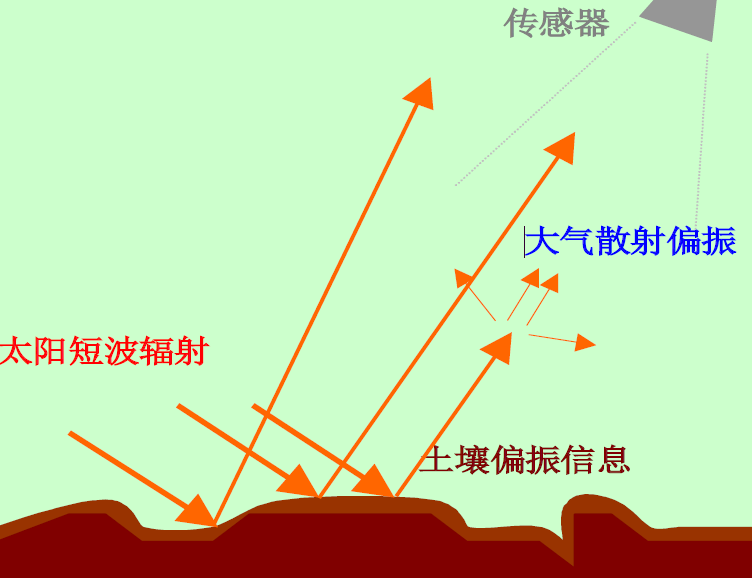
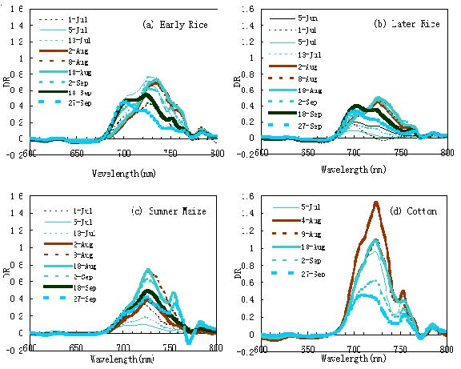
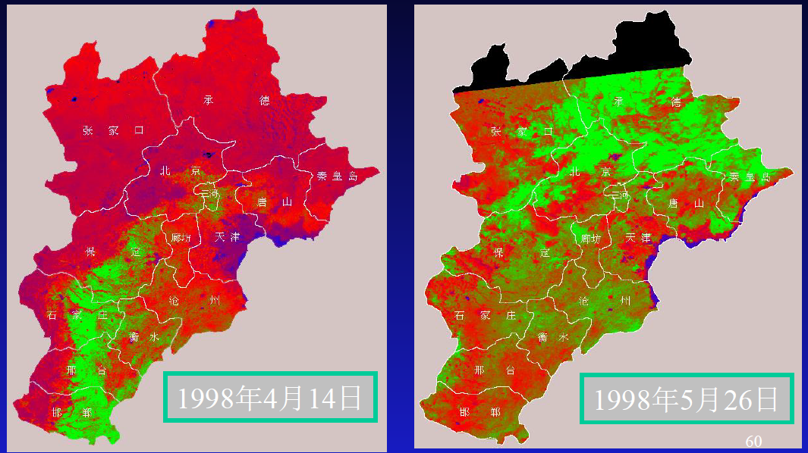
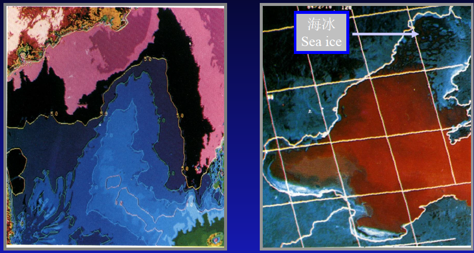
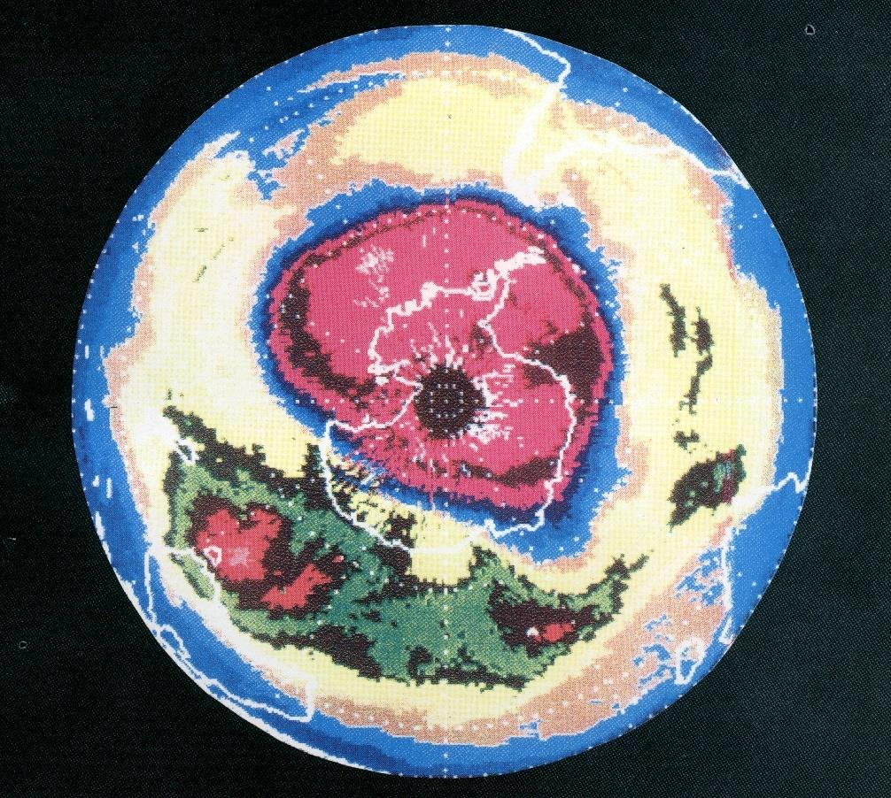
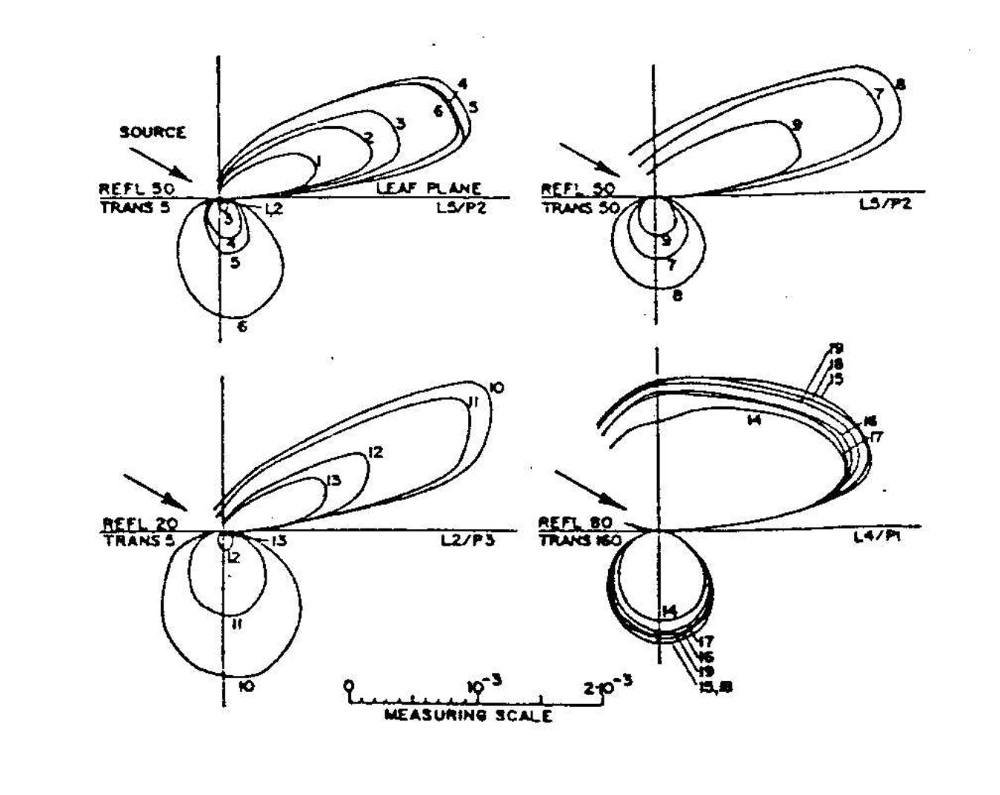
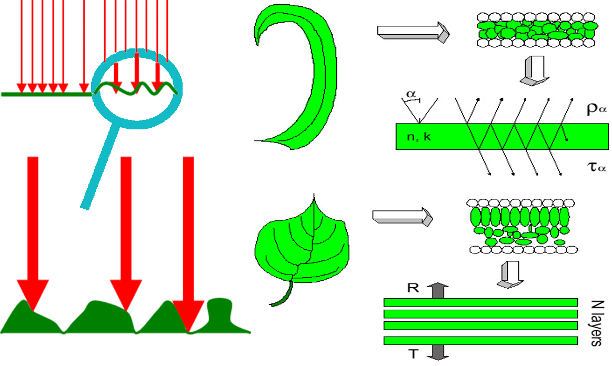

**遥感物理**

- [**绪论**](#绪论)
  - [**课程简介**](#课程简介)
  - [**什么是遥感**](#什么是遥感)
    - [**遥感的定义**](#遥感的定义)
    - [**遥感的最大优势**](#遥感的最大优势)
    - [**遥感的基本内容**](#遥感的基本内容)
  - [**遥感在地球系统科学中的地位**](#遥感在地球系统科学中的地位)
  - [**遥感技术体系**](#遥感技术体系)
    - [**获取地表信息的6种基本手段**](#获取地表信息的6种基本手段)
    - [**20世纪遥感技术体系的基本框架**](#20世纪遥感技术体系的基本框架)
    - [**21世纪遥感技术体系的发展趋势**](#21世纪遥感技术体系的发展趋势)
  - [**遥感应用的现状**](#遥感应用的现状)
    - [**气象卫星应用**](#气象卫星应用)
    - [**海洋卫星应用**](#海洋卫星应用)
    - [**资源环境卫星应用**](#资源环境卫星应用)
    - [**军事卫星应用**](#军事卫星应用)
    - [**发展趋势**](#发展趋势)
  - [**遥感理论体系及其关键问题**](#遥感理论体系及其关键问题)
    - [**寻找适合遥感对象的数学物理学规律**](#寻找适合遥感对象的数学物理学规律)
    - [**建模与反演**](#建模与反演)
    - [**混合像元的信息分解与融合**](#混合像元的信息分解与融合)
    - [**大气效应纠正与大气参数反演**](#大气效应纠正与大气参数反演)
    - [**尺度效应与尺度纠正**](#尺度效应与尺度纠正)
- [**第一章 基本物理概念**](#第一章-基本物理概念)
  - [**电磁波基本概念**](#电磁波基本概念)
  - [**几个物理名词的定义**](#几个物理名词的定义)
  - [**地物的波谱特征与方向谱特征**](#地物的波谱特征与方向谱特征)
- [**第二章 植被遥感应用模型**](#第二章-植被遥感应用模型)
  - [**单片叶子的光谱特征**](#单片叶子的光谱特征)
    - [**叶子的剖面结构**](#叶子的剖面结构)
    - [**单片叶子的波谱特征**](#单片叶子的波谱特征)
    - [**单片叶子波谱特征的理论模型**](#单片叶子波谱特征的理论模型)
      - [**随机模型**](#随机模型)
    - [**单片叶子的非朗伯体特性**](#单片叶子的非朗伯体特性)
    - [**单叶片光谱模型**](#单叶片光谱模型)
      - [**平板模型(plate model)**](#平板模型plate-model)
      - [**PERSPECT模型**](#perspect模型)
  - [**植被冠层的BRDF**](#植被冠层的brdf)
    - [**几何光学模型**](#几何光学模型)
      - [**垂直视条件下的几何光学模型**](#垂直视条件下的几何光学模型)
      - [**斜视条件下离散植被的BRDF**](#斜视条件下离散植被的brdf)
      - [**孔隙率模型**](#孔隙率模型)
      - [**四尺度几何光学模型**](#四尺度几何光学模型)
    - [**连续植被的辐射传输模型**](#连续植被的辐射传输模型)
      - [**辐射传输概念与辐射传输方程**](#辐射传输概念与辐射传输方程)
      - [**连续植被几何结构的数学描述**](#连续植被几何结构的数学描述)
      - [**连续植被光学特性的参数化**](#连续植被光学特性的参数化)
      - [**连续植被的辐射传输方程**](#连续植被的辐射传输方程)
      - [**介绍几种辐射传输方程的近似解法**](#介绍几种辐射传输方程的近似解法)
    - [**蒙特-卡罗（M-C）模拟模型**](#蒙特-卡罗m-c模拟模型)
      - [**概要介绍**](#概要介绍)
      - [**正向追踪与反向追踪**](#正向追踪与反向追踪)
      - [**连续植被辐射传输的蒙特-卡罗模拟**](#连续植被辐射传输的蒙特-卡罗模拟)
  - [**植被光谱参数**](#植被光谱参数)
    - [**植被光谱参数简介**](#植被光谱参数简介)
    - [**植被光谱参数（VI）与叶面积指数（LAI）之间的关系**](#植被光谱参数vi与叶面积指数lai之间的关系)
    - [**植被光谱参数对土壤背景影响消除能力**](#植被光谱参数对土壤背景影响消除能力)
    - [**植被光谱参数的非各向同性性质**](#植被光谱参数的非各向同性性质)
    - [**植被光谱参数的大气效应**](#植被光谱参数的大气效应)
    - [**植被光谱参数的生物学意义**](#植被光谱参数的生物学意义)
    - [**微分植被光谱参数**](#微分植被光谱参数)
- [**第四章 大气效应及其纠正**](#第四章-大气效应及其纠正)
  - [**大气的组成、结构特征及基本物理过程**](#大气的组成结构特征及基本物理过程)
    - [**大气的组成 (臭氧（O3）、二氧化碳（CO2）、水汽（H2O）)**](#大气的组成-臭氧o3二氧化碳co2水汽h2o)
    - [**大气垂直结构特征**](#大气垂直结构特征)
    - [**大气对电磁辐射的吸收**](#大气对电磁辐射的吸收)
    - [**大气对电磁辐射的散射**](#大气对电磁辐射的散射)
  - [**大气效应纠正**](#大气效应纠正)
    - [**蒙特—卡罗模拟及6S公式**](#蒙特卡罗模拟及6s公式)
    - [**植被参数形式下的大气纠正问题**](#植被参数形式下的大气纠正问题)
    - [**交叉辐射的修正问题**](#交叉辐射的修正问题)
    - [**大气效应修正的现状与前途**](#大气效应修正的现状与前途)
  - [**大气气溶胶的遥感问题**](#大气气溶胶的遥感问题)
- [**第六章 热红外遥感**](#第六章-热红外遥感)
  - [**目的和意义**](#目的和意义)
  - [**热辐射场与黑体辐射**](#热辐射场与黑体辐射)
    - [**热辐射场**](#热辐射场)
    - [**基尔霍夫定律**](#基尔霍夫定律)
    - [**黑体辐射公式**](#黑体辐射公式)
    - [**维恩位移定律**](#维恩位移定律)
    - [**亮度温度**](#亮度温度)
    - [**热红外辐射的特点**](#热红外辐射的特点)
  - [**热辐射方向性**](#热辐射方向性)
    - [**发射率的定义 Definition of emissivity**](#发射率的定义-definition-of-emissivity)
    - [**平面纯像元的热辐射方向性问题**](#平面纯像元的热辐射方向性问题)
    - [**非同温三维复杂像元的热辐射方向性问题**](#非同温三维复杂像元的热辐射方向性问题)
    - [**发射率的实验测量方法**](#发射率的实验测量方法)
      - [**积分球方法 Integrating sphere method**](#积分球方法-integrating-sphere-method)
      - [**桶法 Bucket method**](#桶法-bucket-method)
      - [**方向发射率的被动测量方法**](#方向发射率的被动测量方法)
      - [**双通道双温度方法**](#双通道双温度方法)
      - [**发射率的波谱曲线**](#发射率的波谱曲线)
        - [**"对数剩余法”**](#对数剩余法)
        - [**“阿尔法剩余法”**](#阿尔法剩余法)
  - [**海面温度反演**](#海面温度反演)
    - [**黑体近似条件下多波段海面温度反演**](#黑体近似条件下多波段海面温度反演)
    - [**SST的发射率效应**](#sst的发射率效应)
    - [**大气透过率及水汽吸收对SST的非线性效应**](#大气透过率及水汽吸收对sst的非线性效应)
    - [**海面温度的“皮肤”效应**](#海面温度的皮肤效应)
    - [**SST的多角度求取方法**](#sst的多角度求取方法)
  - [**陆面温度反演**](#陆面温度反演)
    - [**遥感陆面温度的复杂性**](#遥感陆面温度的复杂性)
    - [**纯像元陆面温度（LST）的遥感**](#纯像元陆面温度lst的遥感)

# **绪论**

## **课程简介**

为什么要学习遥感物理？
- 理解遥感机理
  - 设计能满足需要的遥感系统，选择适用的遥感数据，采用适当的处理手段。
  - 正确地解释图像和结果（包括遥感图像解译和目标识别）。
- 从定性遥感走向定量遥感的必由之路：遥感可以提供的信息分二类： 几何（geometry）、位置（location）和属性（attribute）
  - 获取几何信息，遥感器自身的位置与姿态（pose），成像几何（imaging geometry），一般的成像遥感器对目标的几何映射是线性空间不变的。
  - 获取属性信息，要回答遥感信息反映的是什么，其质量和数量特征怎样。
  - 目前相当多的遥感应用还只是利用了一小部分信息。比如国内目前遥感应用较多的是分类（classification），属性上主要解决的是什么，几何上解决了在那里，范围大小问题。要获取更多的定量信息，必须建立各种定量模型。
- 地球系统科学的需要
  - 系统、综合、定量地研究地球大气海洋陆地之间的能量与物质交换，以及对人类生存的影响。

遥感物理主要内容
- 核心问题：电磁波与地物的相互作用
- 主要波段：可见光、红外
- 原理、系统、应用；落实到图像
- 电磁波、电磁波谱、辐射源、遥感器系统、大气窗口、地物波谱
- 水、土壤、植被与电磁波的作用
- 电磁波在大气中的传播、吸收、散射

遥感物理与其它课程的关系
- 遥感涉及数学、物理（基础）、地学（目标对象）、信息科学（处理手段）。
- 遥感概论是入门；遥感图像解译、专题遥感都属于应用范畴；遥感物理是深入掌握应用遥感的必要基础。

## **什么是遥感**

### **遥感的定义**

- 遥远地感知
- 遥感就是通过探测地表物体对电磁波的反射和其发射的电磁波，从而提取物体的信息，完成远距离识别物体
- 60年代初在由美国密切安大学等组织发起的环境科学讨论会上正式被采用

### **遥感的最大优势**

1. 获取面状和三维立体信息
2. 对全球表层系统实施同步或准同步观测

人类经济社会的发展，正面临日益严峻的资源环境的制约与挑战。
- 大量依赖不可再生资源
- 淡水资源短缺
- 生态环境退化
- 大气化学成分变化
- 显著的气候变化

当自然与社会环境变得更加复杂和脆弱，遥感和其获得的信息的价值已变得前所未有的重要。

遥感被看作是20世纪以来人类社会发展的一项最为重大和最具吸引力的科学技术成就之一而载入史册。

遥感利用空间卫星、飞机作为平台，从空中和空间对地球进行观测，是一种集数据获取、处理、分析、应用于一体的现代空间信息技术，理所当然地受到包括各国政府在内的全球的广泛关注和竞相发展。新型技术不断创新，应用不断深入。

在以下几个方面、特别在以人们的认识论方面极大地提高和改变了人们的认知方式：
- 空间（space）：可从多维空间，特别是从宏观上将地球、地球各圈层大区域作为一个整体来观测、研究。这是人类认识论、宇宙观的一次大飞跃，其意义不亚于哥白尼从地心学到日心学的宇宙观和认识论上的一次飞跃。
- 时间（time）：可完整、系统地构成各种现象和过程的时间序列并将时间过程精确叠加在空间位置上，超越时空，以更广的视角、更高的分辨率、更快、更多的空间信息实现对地球过程的预测、预报和预警。
- 感知/光谱（perception/spectrum）：除了可见光(色)以外的谱资源的开拓大大拓宽了人们的认知领域，紫外、红外、毫米波、微波、无线电波以至声波、磁力波、重力波、引力波等我们肉眼所看不到的信息载体的开发和利用又更进一步拓展了人类的视野和认识世界的能力。

正如恩格斯所说过的，人眼的特殊构造并不是我们认识事物的一个绝对界限。

### **遥感的基本内容**

- 遥感技术
  - 传感器设计与制造
  - 传感器的扫描姿态
  - 数据传输
  - 原始数据的预处理
  - ...
- 遥感理论：传感器的可测参数（地表的物理、几何、生物、化学参数）的建模与反演
- 遥感应用：遥感信息+背景知识=决策与判断

## **遥感在地球系统科学中的地位**

地学（Geo-science）
- 20世纪以前，地球-科学（Earth-science）主要指探险、地理大发现
- 地球科学（Geoscience）的分支：地理科学、地质科学、大气科学、海洋科学、环境科学...
- 地球系统科学（earth system science）：打破学科界限，将地球作为一个完整系统开展研究

是一个合-分-合的过程。

“遥感”这个名词的含义是被界定在地球科学范畴之内的。

遥感应用是推动遥感发展的原动力。

## **遥感技术体系**

### **获取地表信息的6种基本手段**

1. 多波段遥感 Multi-band RS
  
  
  
电磁波谱与大气窗区

  
  
几种典型地物的波谱特征

  
  
绿色植物的主要光谱响应特性

2. 多极化遥感 Multi-polarization RS

  
  
电磁波在介质表面的反射

  
  
电磁波在土壤表面的反射

  
  
短波的地表偏振信息无法使用

3. 相位差遥感 Phase difference RS

  
  
干涉SAR测量地表的DEM

  $$\left\{
    \begin{aligned}
    &\phi_r=\frac{2\pi}{\lambda}(R_1-R_2)\\
    &\cos(\alpha+\theta)=\frac{R_2^2-B^2-R_1^2}{-2BR_1}\\
    &h=H-R_1\sin\theta
  \end{aligned}
  \right.$$

4. 多角度遥感 Multi-angle RS
5. 多时相遥感 Multi-temporal RS
  
  
  
不同地物的 PVI 值随时间的变化

  > 
  > Planet公司的SkySat小卫星群之前声称可以对任意区域一天拍摄12次。在广西桂平西南有个机场。SkySat卫星在8月几乎每天都对其开展了拍摄。查询界面下面的日期轴上的圆圈就表示有数据的日子。

6. 多像元信息综合遥感 Multi-pixel RS

### **20世纪遥感技术体系的基本框架**

- 气象卫星系列

  

- 海洋卫星系列
- 环境与资源卫星系列
  - Landsat计划
  - SPOT卫星系列
  - EOS计划
- 军事侦察及测绘卫星系列
  - KH-11、KH-12
  - 尖兵系列

### **21世纪遥感技术体系的发展趋势**

1. 多分辨率传感器并存
2. 多波段、多角度及多极化遥感并用

  
  
不同水分含量植被光谱比较

  > 
  > 植被导数光谱分析模型
  > - 反映光谱的变化，特别是植被红边的“突变”。
  > - 减少环境干扰，反映植被活力。
  
  > 
  植被积分光谱分析：不同作物、不同物候历积分光谱数值差异。反映植被生长状况、叶面积指数或植被覆盖度、叶绿素含量、细胞和光合作用的活力。

  
  
不同观测角度差异

  
  
不同观测高度和角度差异

  
  
GPS探测大气廓线原理

3. RS、GPS与GIS的集成

  
  
SPOT影像与数字地形模型复合

一个强大，综合和灵活的遥感技术体系所获取和生成的信息能够满足短期和长期的紧迫需求， 对诸多领域提供强有力的数据分析支撑。

- 减轻气候变化带来的副作用
- 可再生资源开发
- 确保水资源供给
- 保护生态系统
- 改善人类健康

## **遥感应用的现状**

### **气象卫星应用**

大兴安岭南麓地区产草量估算

1987年河南省冬小麦播种面积

河北省冬小麦长势监测--PVI值

洞庭湖区土地利用

大兴安岭林火动态监测

渤海湾海温与海冰图

泥沙监测

台风

渤海湾叶绿素

黄海长江口水色图

可见光云图影像

### **海洋卫星应用**

L-SAR遥测海面波浪

散射计遥测海面风向和风速

全球海面温度

环流引起全球平均海平面变化图

CZCS传感器用于海面叶绿素遥感

1996年9月12日南极臭氧洞

### **资源环境卫星应用**

伦敦市Spot影像（假彩色）

北京市TM与SAR复合图象

美国加州西部地区山前洪积扇Landsat-7影像

自然灾害的监测

自然灾害的监测：旱情监测的难点

- 土壤热惯量法、作物缺水指数法、能量平衡模型（单层和双层模型）等无法满足现实需要
- 准确监测旱情需要遥感提供3个参数：土壤水分含量、作物缺水状况、作物叶绿素含量。遥感精确反演这三个地表参素相当困难。

### **军事卫星应用**

机场被轰炸前后的遥感影像

### **发展趋势**

## **遥感理论体系及其关键问题**

遥感是在经典物理学、数学、地学、大气科学和海洋学等学科基础上发展起来的一门新兴的交叉学科。这些学科都建立了自己的严格理论体系，遥感也需要发展自身的理论体系。

### **寻找适合遥感对象的数学物理学规律**

电磁波与物体相互作用的规律，对遥感来说是基础性的重要课题。

混合像元热辐射方向性

### **建模与反演**

$$传感器的可测参数_{反演}\leftrightarrows^{建模}地表的物理、几何、生物、化学参数$$ 

方程f1和f2之间不同相关类型

### **混合像元的信息分解与融合**

- 如何理解混合像元测量值的物理意义？它与组分对应量之间存在何种关系？这就是混合像元的信息分解。
- 当像元尺度发生变化时，不同尺度所对应的同一物理量之间该发生何种关联呢？这也就是我们所称的混合像元信息的尺度融合问题。

### **大气效应纠正与大气参数反演**

### **尺度效应与尺度纠正**

# **第一章 基本物理概念**

## **电磁波基本概念**

电磁波定义：在空间传播的交变电磁场。它是一种物质，是相互依存（且同时达到最大/最小）的电场和磁场的总和。电场和磁场一有变化，就会以光速传播，形成电磁波。具有质量、动量、能量，静止质量为0。

- 电磁波的波动性：
  - 1860年麦克斯韦（C.Maxwell)提出光是电磁波的理论。
  - 光在传播时表现出波动性，如光的干涉、衍射、偏振、反射、折射。
  - 性质：
    - 振幅$A$
    - 波长$\lambda$
    - 周期$T$
    - 频率$f=\frac{1}{T}$（单位赫兹$Hz$）
    - 速度$v$

    $$\varphi=A\sin[(\omega t-kx)+\phi]$$

    - $\varphi$是电场强度
    - $\omega=\frac{2\pi}{T}$
    - $k=\frac{2\pi}{\lambda}$
    - $\phi$为相位

  $$\left\{
    \begin{aligned}
    &\oint_lH\cdot dl=\int_sJ\cdot ds+\int_s\frac{\partial D}{\partial t}\cdot ds\\
    &\oint_lE\cdot dl=-\frac{d}{dt}\int_sB\cdot ds\\
    &\oint_sB\cdot ds=0\\
    &\oint_sD\cdot ds=\int_s\rho dv
  \end{aligned}
  \right.$$

  根据麦克斯韦方程组可推导出$c=\lambda f$为定值，$c=2.998\times10^8m/s$。

- 电磁波的粒子性：1900年,普朗克（Max.Planck)提出了辐射的量子论，1905年，爱因斯坦（Albert.Einstein)将量子论用于光电效应之中，提出光子理论。光与物质作用时表现出粒子性，如光的发射、吸收、散射。
  - 把电磁波作为粒子对待时，能量
  
  $$Q=hf$$

  - $h$是普朗克常数（$6.626\times10^{-34}J\cdot s$）。能量越大，波长越短，粒子性越强，直线性越强。

电磁波谱：电磁波信号是遥感研究的对象，区分电磁波特性的主要因子之一是波长（频率），电磁波依据波长轴线的分布称为电磁波谱。

电磁辐射产生于各种形式的能量：机械能、化学能、热能、电能、磁能、核能等。

凡是温度高于绝对零度（$-273.16^\circ C$）的物体都发射电磁波，波长由物质内部状态的变化决定。

热能：物质分子无规则运动的机械能，随机，宽谱带的电磁发射。

$$M_B(\lambda,T)=\frac{2\pi hc^2}{\lambda^5}\cdot\frac{1}{e^\frac{hc}{\lambda kT}-1} Wm^{-2}{\mu m}^{-1}$$

其中
- $h$: 普朗克常数
- $c$: 光速
- $k$: 玻尔兹曼常数$1.3806\times10^{-23}JK^{-1}$
- $T$: 绝对温度

可见光与近红外波段遥感的两个基本特征：
- 遥感所利用的电磁波波长范围选择在$0.4μm$到$2.5μm$之间 
- 以太阳作为光源 

## **几个物理名词的定义**

电磁辐射是具有能量的，它表现在：
- 使被辐照的物体温度升高
- 改变物体的内部状态
- 使带电物体受力而运动

**辐射场**：

- 任何温度高于绝对零度的物体都在向外辐射各种频率的电磁波，我们称之为物体辐射场。  
- 在物体和物体之间的空间里总存在着各种频率的电磁辐射场，每个物体通过发射与吸收过程与周围的辐射场交换着能量。   

**辐射能量$Q$**

- 电磁波是物质存在的一种形式
- 电磁场亦具有能量、动量等性质
- 电磁场所具有的能量称之为辐射能量

单位：尔格($erg$)、焦耳($J$)、卡($cal$)

**辐射通量$\Phi$**

单位时间内穿过某一面积的电磁辐射能量

$$\Phi=\frac{dQ}{dt}$$

单位：$W$

分谱辐射通量：辐射通量是波长$λ$的函数，单位波长间隔内的辐射通量称为分谱辐射通量。

$$\Phi_\lambda=\frac{\partial\Phi}{\partial\lambda}$$

分谱辐射通量的单位是瓦/微米（$W/μm$）

**辐射通量密度$E$**

单位时间内，穿过单位面积的电磁辐射能量($Wm^{-2}$)

$$E=\frac{d\Phi}{dA}$$

- 当电磁波由体外穿入体内时所构成的辐射通量密度，通称为入射度(Irradiance)，用$E$表示；
- 当电磁波由体内穿出体外时，称之为出射度(Radiant emittance)，一般用$M$表示之。          

**辐射强度$I$**

描述点辐射源强度的物理量，描述了辐射通量在$2π$空间中的变化状况（$W{sr}^{-1}$）

$$I=\frac{d\Phi}{d\omega}$$

**立体角（Solid Angle）**

立体角定义（极坐标中）：

$$\Omega=\frac{A_2}{r^2}$$

微分立体角元：$d\Omega=\frac{dA_2}{r^2}=\sin\theta d\theta d\varphi$

沿经线边长：$rd\theta$

沿纬线边长：$r\sin\theta d\varphi$

**辐射亮度$L$**

单位投影面积上单位立体角内的辐射通量，是表述面光源强弱的物理量（$Wm^{-2}{sr}^{-1}$）

$$L(\theta)=\frac{d^2\Phi}{d\omega d(A\cos\theta)}=\frac{dI}{d(A\cos\theta)}$$

朗伯余弦定律

$$I(\theta)=I_n\cos\theta$$

$$dI=L(\theta)\cos\theta dA$$

各向同性（指辐亮度大小与方向无关）

$$L(\theta)=L$$

$$dM=L(\theta)\cos\theta d\Omega$$

$$
\begin{aligned}
M&=\int_{2\pi}L\cos\theta d\Omega\\
&=L\int_0^\frac{\pi}{2}\cos\theta\sin\theta d\theta\int_0^{2\pi}d\varphi\\
&=\pi L
\end{aligned}
$$

朗伯表面

辐射度量示意图

辐射度量一览表

|辐射量|符号|定义|单位|
|-|-|-|-|
|辐射能量|$Q$||焦耳($J$)|
|辐射通量|$\Phi$|$\frac{\partial Q}{\partial t}$|瓦($W$)|
|辐照度|$E$|$\frac{\partial\Phi}{\partial A}$|$瓦/米^2(W/m^2)$|
|辐射出射度|$M$|$\frac{\partial\Phi}{\partial A}$|$瓦/米^2(W/m^2)$|
|辐射强度|$I$|$\frac{\partial\Phi}{\partial\Omega}$|$瓦/球面度(W/sr)$|
|辐射亮度|$L$|$\frac{\partial^2\Phi}{\partial A\partial\Omega}$|$瓦/(米^2球面度)(W/(m^2\cdot sr))$|

**太阳辐射**

太阳发射的电磁辐射（辐照度）在地球大气顶层随波长的分布称为太阳光谱。

夫琅和费吸收线

**太阳常数**

在日地平均距离处通过与太阳光束垂直的单位面积上的太阳辐射通量称为太阳常数。 

$$F_0=1353(\pm21) W/m^2\tag{1976, NASA}$$

上图大气层顶的通量密度为

$$F=F_0(\frac{d_m}{d})^2\cos\theta$$

$0.9674<(\frac{d_m}{d})^2<1.0344$。此处太阳常数是对太阳光谱的积分。太阳对地球的张角很小（$<9''$），因此太阳光可以认为是平行光束。

**辐射能的分布函数**

$$f(\nu,\bar{s},\bar{r},t)$$

- 式中$\nu$为电磁波的频率，$\bar{s}$为电磁波传播方向的单位矢量，$\bar{r}$为空间坐标矢量，$t$为时间
- 其物理意义是：在时刻$t$，$\bar{r}$点附近单位体积内辐射场中以$\nu$为中心频率的频段$d\nu$内以$\bar{s}$方向为轴的$d\omega$立体角内电磁场能量为

$$f(\nu,\bar{s},\bar{r},t)d\nu d\omega$$

> 单位是$J/(m^3\cdot sr\cdot Hz)$

**辐射场的能量密度及其谱密度**

能量密度$U(\bar{r},t)$

谱密度$u(\nu,\bar{r},t)$

$$u(\nu,\bar{r},t)=\oiint_{4\pi}f(\nu,\bar{s},\bar{r},t)d\omega$$

$$U(\bar{r},t)=\int_0^\infty u(\nu,\bar{r},t)d\nu$$

$U$的单位是$焦耳/米^3(J/m^3)$

**辐射场的亮度$L$及其谱密度$l$**

$$
\begin{aligned}
l(\nu,\bar{s},\bar{r},t)&=cf(\nu,\bar{s},\bar{r},t)\\
L(\bar{s},\bar{r},t)&=\int_0^\infty l(\nu,\bar{s},\bar{r},t)d\nu
\end{aligned}
$$

- 其中$c$为光速（电磁波传播速度）
- $L$的物理意义是：沿$\bar{s}$方向单位立体角内的辐射能流密度，单位$瓦/(米^2球面度) (W/(m^2\cdot sr))$。

通过**面元**$\Delta\bar{s}$的**辐射通量**$\Delta\Phi$及**辐射通量谱密度(Spectral flux density)**$\Delta\phi(\nu)$

> 面元的法向也是单位矢量，所以面元使用$\Delta\bar{s}$符号。但$\Delta\bar{s}$和$\bar{s}$之间有一个夹角$\theta$

$$
\begin{aligned}
\Delta\phi(\nu)&=\iint_{2\pi}l(\nu,\bar{s},\bar{r},t)\bar{s}\cdot\Delta\bar{s}d\omega\\
&=\iint_{2\pi}cf\bar{s}\cdot\Delta\bar{s}d\omega\\
&=\iint_{2\pi}cf\Delta s\cos\theta d\omega
\end{aligned}
$$

> 辐亮度谱密度$l$单位是$W/(m^2\cdot sr\cdot Hz)$；$\Delta\phi(\nu)$的单位是$W/Hz$，二者之间差了$m^2\cdot sr$。
> 
> $W/(m^2\cdot sr\cdot Hz)=J/(s\cdot m^2\cdot sr\cdot Hz)$，与$f$的单位$J/(m^3\cdot sr\cdot Hz)$差了$m/s$，所以要补个光速上去。

对立体角的积分仅限于面元的一侧。如辐射场具有各向同性性质，则

$$
\begin{aligned}
\Delta\phi(\nu)&=\pi cf\Delta s(\nu,\bar{r},t)\\
\Delta\Phi&=\int_0^\infty\Delta\phi(\nu,\bar{r},t)d\nu
\end{aligned}
$$

> 计算过程类似于朗伯定律。

$\Delta\Phi$的单位通量密度的谱函数密度$M(\nu)$

$$M(\nu)=\frac{d\phi(\nu)}{dA}$$

对于满足各向同性的辐射场

$$E(\nu)=\frac{c}{4}u(\nu)$$

> 辐射场的能量谱密度$u$单位是$J/(m^3\cdot Hz)$，辐照度$E$单位是$W/(m^2\cdot Hz)$，二者之间也是差个$m/s$补一个光速。

$$\alpha(\beta)=\frac{\Delta\phi''(\nu)}{\Delta\phi'(\nu)}$$

$\alpha$是吸收率。

$\Delta\phi'(\nu)$为照射物体表面的辐射通量谱密度。

$\Delta\phi''(\nu)$为被物体所吸收的辐射通量谱密度。

## **地物的波谱特征与方向谱特征**

电磁波的散射和吸收

- 当电磁波在介质中传播时，会发生散射和吸收，其中散射又分为反射和透射。   
- 反射与透射区别在于电磁波出射的方向。
- 吸收使电磁波强度减弱。
- 在热红外和微波区域，还存在介质自身发射的电磁波，增强电磁波强度。  

**反射率$\rho$**

反射率为反射辐射（亮度）与入射辐射（亮度）之比，是以比例形式表征的反射辐射强度。

$$\rho=\frac{L_r}{L_i}$$

反射率$\rho$、透射率$\tau$、吸收率之间$\alpha$的关系

$$\rho+\tau+\alpha=1$$

注意介质有无发射是不同的。

**地物的波谱特征**指该地物对太阳辐射的反射、散射能力随波长而变的规律。

**地物的方向特征**是用来描述地物对太阳辐射反射，散射能力的空间变化，这种空间变化特征主要决定于两种因素，其一是物体的表面粗糙度，而且还与视角关系密切。

电磁波在土壤表面的反射

所以从垂直介面的方向看，一个物体可以展示出粗糙面的特性。

当视线的高度角趋于零时，它的行为向光滑面“过渡”，这种过渡的快慢因目标不同而异。

物体的三维几何结构特征及其阴影的影响，这种目标物三维结构与阴影的影响取决于目标-太阳-传感器三者之间的空间关系。

**主平面**：太阳入射平面

垂直主平面

**主锥面**：绕天顶方向以太阳天顶角旋转一周形成的锥面

**热点**：与太阳入射方向重合时，观测到的地表最为明亮

**镜面反射**

如果界面相对入射波长$λ$而言非常光滑（$λ\gg$界面粗糙度），则反射是镜面的。

**折射定律**（斯涅耳 Snell 定律）表征了入射角与折射角的关系：

$$n_1\sin\theta_i=n_2\sin\theta_t$$

其中$n$为折射系数。

**菲涅耳公式**表征了反射辐射与透射辐射强度：

任一振动方向的电磁波总可以分解为两个特定的偏振（极化）方向。电矢量$E$的振动面垂直入射面的线偏振称为水平极化，平行入射面的线偏振称为垂直极化。

- 对于水平极化，振幅的反射比
  
  $$r_h=\frac{n_1\cos\theta_i-n_2\cos\theta_t}{n_1\cos\theta_i+n_2\cos\theta_t}=\frac{-\sin(\theta_i-\theta_t)}{\sin(\theta_i+\theta_t)}$$

- 对于垂直极化，振幅的反射比

  $$r_v=\frac{n_2\cos\theta_i-n_1\cos\theta_t}{n_2\cos\theta_i+n_1\cos\theta_t}=\frac{\tan(\theta_i-\theta_t)}{\tan(\theta_i+\theta_t)}$$

**漫反射**

实际上多数自然表面对辐射的波长而言都是粗糙表面。当目标物的表面足够粗糙，以致于它对太阳短波辐射的反射辐射亮度在以目标物的中心的$2π$空间中呈常数，即反射辐射亮度不随观测角度而变，我们称该物体为漫反射体，亦称朗伯体。漫反射又称朗伯(Lambert)反射，也称各向同性反射。

严格讲自然界中只存在近似意义下的朗伯体。只有黑体才是真正的朗伯体。

**粗糙度**

瑞利准则：

一个表面在身体感觉上可能是平滑的，也就是说，看起来和摸起来都是平滑的。但是在可见光波长尺度下，那个表面可能会出现许多不规则的形状。

一般采用高度的标准偏差： 

$$\sigma=\sqrt{\Sigma{\Delta h}^2}$$

$\sigma<\frac{\lambda}{25\cos\theta}$ 平滑表面

$\sigma>\frac{\lambda}{8\cos\theta}$ 粗糙表面

地物反射

**天顶角$θ$** 在表述辐射中的作用：

若辐射亮度为$L_0$的辐射，以入射角$\theta_0$辐射到物体表面，则入射辐射亮度$L_i$为

$$L_i=L_0\cos\theta_0$$

**地物反射特征的几种描述方法**

- 双向反射率分布函数(BRDF) 
- 双向反射率因子（BRF） 
- 半球反射率（albedo）
- 方向->半球反射率与半球->方向反射率 

各角度几何关系定义

- $\theta_0$太阳天顶角
- $\phi_0$太阳方位角
- $\theta$观测天顶角
- $\phi$相对方位角

**双向反射率分布函数(Bidirectional Reflectance Distribution Function, BRDF)**

来自$\bar{i}$方向地表辐照度的微增量与其所引起的$\bar{r}$方向上反射辐射亮度增量之间的比值

$$f(\theta_0,\phi_0,\theta,\phi,\lambda)=\frac{dL(\theta,\phi,\lambda)}{dE(\theta_0,\phi_0,\lambda)}$$

其中

- 投射向$L(\theta_0,\phi_0,\lambda)$点目标，造成该点目标的辐照度为     

  $$dE=L(\theta_0,\phi_0,\lambda)\cos\theta_0d\omega$$

- 传感器从$\bar{r}(\theta,\phi)$方向观察目标物，接收到
来自目标物对外来辐射的反射、散射辐射，
其亮度值为    
  $$dL(\theta,\phi,\lambda)$$

为什么引入BRDF？
- 在现实世界中投射到地物表面上的辐射能量往往有两部份组成，即来自太阳的直射辐射与天空散射辐射。
- 传感器在方向上测得的辐射亮度是空间入射辐射场的综合效应，它不仅与该点地物的反射特性有关，而且与辐射环境（即入射辐射亮度的空间分布函数）有关。

如何避免环境辐射？
1. 设定入射辐射场为$δ$分布函数。
2. 把入射辐射亮度$L$变换为对目标的辐照度，这样就消除了来自不同方向的$L$可能对值的影响。
3. 采用$\frac{dL}{dE}$比值形式，而不采用绝对值。

BRDF特点
- 与辐射环境无关，它仅与该地物的反射、散射辐射特性有关，并且具有${sr}^{-1}$的量纲。
- 是$\theta,\phi,\theta_0,\phi_0$与$\lambda$ 5个自变量的函数。
- 从理论上能较好地表征地物的非朗伯体特性，但在实际测量上困难较大，精确测量$dE(\theta_0,\phi_0,\lambda)$很困难。

理想的漫反射体的BRDF值为$\frac{1}{\pi}$

$$f_p=\frac{dL_p}{dE_p}=\frac{\frac{dM_p}{\pi}}{dM_p}=\frac{1}{\pi}$$

**双向反射率因子（BRF）**

定义：在相同的辐照度条件下，地物向$\bar{r}$方向的反射辐射亮度与一个理想的漫反射体在该方向上的反射辐射亮度之比值，称为双向反射率因子，一般用$R$表示。

$$R=\frac{dL_T(\theta,\phi,\lambda)}{dL_p(\theta,\phi,\lambda)}$$

- BRF的定义并没有对辐射环境作任何限定，因此严格讲$R$值不仅取决于目标物的非朗伯体特性，而且还与辐射环境有关。
- BRF并不是一个理想的描述地物非朗伯体特性的物理量。
- 与BRDF有原则上的不同，两者的量纲亦不相同，这充分地表明了它们的区别。
- 如果入射光源对目标物所张的立体角，以及传感器对目标物所张的立体角都趋于无穷小，则

  $$R=\frac{dL_T}{dL_p}=\frac{f_TdE}{f_pdE}=\pi f_T$$

  $$f_T=\lim_{\Delta\omega,\Delta\omega_0\to0}\frac{R}{\pi}$$

> 这里的$f_T$是BRDF

**半球反射率**

目标物的出射度与入射度之比值称为半球反射率，通常用符号$\rho$表示之。它在辐射热平衡和作物光合作用强度中都是较为关键的物理量。

$$\rho=\frac{M}{E}$$

**方向->半球反射率**

$$\int_{2\pi}f(\theta_0,\phi_0,\theta,\phi,\lambda)\cos\theta_0d\Omega=r_{\theta_0,\phi_0\to\Omega}$$

**半球->方向反射率**

$$\int_{2\pi}f(\theta_0,\phi_0,\theta,\phi,\lambda)\cos\theta_0d\Omega_0=r_{\Omega_0\to\theta,\phi}$$

注意

$$r_{\Omega_0\to\theta,\phi}\neq r_{\theta_0,\phi_0\to\Omega}$$

地面多角度测量所采用的观测架

# **第二章 植被遥感应用模型**

## **单片叶子的光谱特征**

### **叶子的剖面结构**

正常生长的植被在多数情况，其波谱特征基本上被叶簇所控制，因此讨论植被的波谱特征，首先应当了解单片叶子的光谱特征，光辐射与单叶子的相互作用基本上包括两种物理过程，散射(反射)与吸收。

(a)假想的典型健康叶片的剖面 (b)叶片的电子显微影像

- 蜡质层
- 表皮层
- 海绵组织和叶肉组织
  - 吸收
  - 散射
    - 瑞利散射（蛋白质、碳水化合物等）
    - 米氏散射（叶绿体）
    - 漫反射（多次散射和折射）
- 下表皮

### **单片叶子的波谱特征**

健康绿色叶片在0.4-2.6μm的反射光谱特征

- $0.4\mu m\sim0.7\mu m$
  - 叶绿素a、b，在$0.45\mu m$与$0.64\mu m\sim0.68\mu m$为中心有两个强烈的吸收带
  - 胡萝卜素、叶黄素在$0.43μm\sim0.48μm$范围内有强烈的吸收带
- $0.7\mu m\sim1.1\mu m$
  - 散射作用占据了主导地位，透入叶子内部的光线，因细胞壁与细胞孔腔的折射率有明显的差异，因而造成光线在叶子内部的多次反射与折射

组分吸收系数

- $1.1\mu m\sim2.5\mu m$: 这一波段范围的波谱特征基本上被液态水的吸收特性所控制，两个强烈的吸收峰，中心分别在$1.42\mu m$与$1.96\mu m$
- 红边Red edge: 从以$0.68\mu m$为中心的反射率极小值过渡到从$0.8μm$开始的反射峰，其间必存在一个拐点

$\rho_\lambda+\tau_\lambda+\alpha_\lambda=1$

叶片反射率的测量：使用积分球，用来测量小目标组分光谱

### **单片叶子波谱特征的理论模型**

**朗伯-比尔消光定律**：介质中传输的一束辐射，将因它与物质的相互作用而减弱。如果辐射强度作用减弱，$I_\lambda$在它传播方向上通过$ds$厚度后变为$I_\lambda+dI_\lambda$，则        

$$dI_\lambda=-k_\lambda\rho I_\lambda ds$$

式中$ρ$是物质密度，$k_\lambda$表示对辐射波长$\lambda$的质量消光截面。辐射强度的减弱是由物质中的吸收以及物质对辐射的散射引起的。

另一方面，辐射强度也可以由于相同波长上物质的发射以及多次散射而增强，多次散射使所有其它方向的一部分辐射进入所研究的辐射方向。我们定义源函数系数$j_\lambda$，使由于发射和多次散射造成的强度增大为

$$dI_\lambda=j_\lambda\rho ds$$

源函数系数$j_\lambda$具有和质量消光截面$k_\lambda$类似的物理意义。联合上述两个方程得到辐射强度总的变化为

$$dI_\lambda=-k_\lambda\rho I_\lambda ds+j_\lambda\rho ds$$

方便起见，进一步定义源函数$J_\lambda$如下

$$J_\lambda\equiv\frac{j_\lambda}{k_\lambda}$$

这样一来，源函数具有辐射强度的单位。因此

$$dI_\lambda=-k_\lambda\rho I_\lambda ds+k_\lambda J_\lambda\rho ds$$

$$\frac{dI_\lambda}{k_\lambda\rho ds}=-I_\lambda+J_\lambda$$

当忽略多次散射和发射的增量贡献时，辐射传输方程可以简化为

$$\frac{dI_\lambda}{k_\lambda\rho ds}=-I_\lambda$$

如果在$s=0$处的入射强度为$I_\lambda(0)$，则在$s_1$处，其出射强度为

$$I_\lambda(s_1)=I_\lambda(0)\exp(-\int_0^{s_1}k_\lambda\rho ds)$$

假定介质消光截面均一不变，即kλ不依赖于距离s，并定义路径长度$u=\int_0^{s_1}\rho ds$，此时出射强度为

$$I_\lambda(s_1)=I_\lambda(0)e^{-k_\lambda u}$$

这就是著名的比尔定律，或称布格定律，也可称朗伯定律。它叙述了忽略多次散射和发射影响时，通过均匀介质传播的辐射强度按简单的指数函数减弱，该指数函数的自变量是质量吸收截面和路径长度的乘积。由于该定律不涉及方向关系，所以它不仅适用于强度量，而且也适用于通量密度。

#### **随机模型**

1977 年C.J.Tucker 对单片叶子的波谱特征进行了数值模拟，他把光子与叶子的相互作用分解为十个相互独立，而又有联系的子过程。

1. 太阳入射辐射 Solar incident radiation
2. 蜡质层反射的太阳辐射 Solar radiation reflected by the wax layer
3. 辐射进入栅栏组织 Radiation into the palisade tissue
4. 栅栏组织的吸收 Absorption of palisade tissue
5. 栅栏组织的散射 Scattering of palisade tissue
6. 漫射反射的辐射 Diffuse reflected radiation
7. 辐射进入海绵组织 Radiation into the sponge tissue
8. 海绵组织的吸收 Absorption of sponge tissue
9. 海绵组织的散射 Scattering of sponge tissue
10. 漫射透射的辐射 Diffuse transmitted radiation

连接这十个部分之间的箭头表示它们之间可能存在的转移过程，只要能确定过程之间的转移概率，那么光辐射与单片叶子之间的相互作用过程就可以被模拟，用$R_{i,j}$表示由$j$状态向$i$状态的转移概率，例如$R_{4,3}$代表光子在栅栏组织中被吸收的概率，显然这决定于吸收物质的种类、含量及吸收系数。

在栅栏组织中，根据Beer消光定律

$$I=I_0\exp(-k(i)x(i))$$

$I_0$为入射光强，$k$为吸收系数，$x$代表栅栏组织内某吸收物质的总含量。显然用$(1-\frac{I}{I_0})$代表被吸收的概率是合理的。在栅栏组织中有4种吸收物质，它们是液态水，叶绿素a与b以及胡萝卜素，因此

$$R_{4,3}=\sum_{i=1}^4(1-\exp(-k(i)x(i)))$$

如果假定光子经一次散射后再次被散射或被吸收的概率相等，则$R_{4,5}＝\frac{1}{2}R_{4,3}$。同理可得$R_{8,7}$

$$R_{8,7}=\sum_{i=1}^4(1-\exp(-k(i)x_{sm}(i)))$$

其中$x_{sm}(i)$代表第$i$种物质在海绵状叶肉层的总含量。$R_{8,9}=\frac{1}{2}R_{8,7}$

如用$(1-R_{4,3})$代表光子进入栅栏组织后未被吸收的概率，并进一步假定其中一半光子未经碰撞而穿出栅栏组织直接进入海绵状组织，另一半停留在栅栏组织内，则

$$R_{5,3}=R_{7,3}=\frac{1-R_{4,3}}{2}$$

假定进入栅栏组织的辐射经散射后有一半被吸收，另一半穿过栅栏组织漫射反射出去或向下进入海绵组织，而漫射反射进入海绵组织的概率取决于它们之间的质量之比，则

$$R_{6,5}=R_{5,3}\frac{x}{2(x+x_{sm})}$$

$$R_{7,5}=R_{5,3}\frac{x_{sm}}{2(x+x_{sm})}$$

其余项

$$
\begin{aligned}
R_{9,7}&=1-R_{8,7}\\
R_{5,5}&=1-R_{4,5}-R_{6,5}-R_{7,5}\\
R_{9,9}&=1-R_{3,9}-R_{10,9}-R_{8,9}\\
R_{2,2}&=R_{4,4}=R_{6,6}=R_{8,8}=R_{10,10}=1\\
R_{3,1}&=1-R_{2,1}\\
R_{10,9}&=0.12\\
R_{3,9}&=0.08\\
R_{2,1}&=0,01
\end{aligned}
$$

其他上面未涉及的$R_{i,j}$值均取$0$，即为不可能事件。

假设在下列假设条件下进行数值模拟：
1. 光线垂直直射叶子表面
2. 上表面蜡层的反射率为$1\%$
3. 上、下表皮层为透明层
4. 叶绿素a与b之间的比例为$3:1$，总浓度为$0.024mg/cm^2$
5. 胡萝卜素的含量比例为$25\%$，总浓度为$0.008mg/cm^2$
6. 水分含量为总重的$70\%$，总等值水厚度为$0.014cm$
7. $R_{10,9}=0.12, R_{3,9}=0.08$
8. 叶子内部各部份之间散射光强度之比决定于它们之间的质量之比。
9. 假定叶子温度为$20℃$

用矩阵$P$表达上述过程及其间相互关系，则

$$
P=\left[\begin{matrix}
  0&R_{2,1}&R_{3,1}&0&0&0&0&0&0&0\\
  0&R_{2,2}&0&0&0&0&0&0&0&0\\
  0&0&0&R_{4,3}&R_{5,3}&0&R_{7,3}&0&0&0\\
  0&0&0&R_{4,4}&0&0&0&0&0&0\\
  0&0&0&R_{4,5}&R_{5,5}&R_{6,5}&R_{7,5}&0&0&0\\
  0&0&0&0&0&R_{6,6}&0&0&0&0\\
  0&0&0&0&0&0&0&R_{8,7}&R_{9,7}&R_{10,7}\\
  0&0&0&0&0&0&0&R_{8,8}&0&0\\
  0&0&0&0&0&0&0&R_{8,9}&R_{9,9}&R_{10,9}\\
  0&0&0&0&0&0&0&0&0&R_{10,10}
\end{matrix}\right]
$$

其初始状态为（角标$T$表示转置矩阵）

$$P_0^T=(1,0,0,...)$$

假定过程是平稳的,因此可用平稳马尔柯夫链描述之，经$n$步之后的概率为:

$$P_n=P^nP_0$$

最终状态为

$$\lim_{n\to\infty}P^nP_0=p$$

如果$p$中的元素取值为$0$，则表明该过程为不稳定过程，即不可能出现的过程，如果取值为$1$则代表必然过程，如果取值为$0\sim1$之间的某个值，则该过程出现的概率为该值所描述。那么

- 最终反射率为$p$中状态$2$和$6$的和。
- 吸收率为状态$4$和$8$的和,透过率为状态$10$。

随机模型模拟的黑枫树叶片反射率与实测值比较

### **单片叶子的非朗伯体特性**

意义

- 是建立正确植被冠层双向反射率模型的基础。
- 建立单片叶子的非朗伯体模型将为人们利用偏振度测量获取更多有用的植被信息铺平道路。

1. 反射率因子的极大值一般在主平面内前向散射方向，方位角约在$150°\sim180°$之间，极小值在天底角附近。
2. 入射光天顶角越大，这种非朗伯体特性越显著。
3. 一般讲随视角天顶角的增加，其双向反射率因子随之增加，增加的速率随角度增加而增加，我们称这为碗边效应，当$\le20°$时，可以被视为近似朗伯体。
4. 叶子内部物质对可见光的强烈吸收，以及对近红外波段弱吸收，致使可见光波段的$(BRF)_v$数值上小于近红外波段的$(BRF)_{ir}$。
5. 透射率因子（BTF）比反射率因子（BRF）更接近朗伯体。
6. 当入射光的天顶角越大，则前向散射极大值附近的BRF的偏振度亦越大。
7. 方向—半球反射率因子随入射光的天顶角增加而增加，而方向—半球透射率因子则呈相反的变动趋势。

$$R=R_m\cos^b(\frac{\theta-\theta_m}{\omega})$$

- $R_m$为BRF的极大值
- $\theta_m$为BRF取极大值时的天顶角
- $\omega$是为了使在叶子平面内的散射亮度等于零而引入的变换参数。极大值左、右边的$\omega$值可能不同，故包含两个值$\omega_l$和$\omega_r$
- $b$为参数，为控制主瓣宽度而设
 
要求$\omega_r+\omega_r=2$，如果$\theta_m$取弧度为单位，则

$$
\left\{\begin{aligned}
\omega_l&=1+\frac{2\theta_m}{\pi}\\
\omega_r&=1-\frac{2\theta_m}{\pi}
\end{aligned}\right.
$$

### **单叶片光谱模型**

#### **平板模型(plate model)**

> William A. Allen, Harold W. Gausman, Arthur J. Richardson, and James R. Thomas, "Interaction of Isotropic Light with a Compact Plant Leaf*," J. Opt. Soc. Am. 59, 1376-1379 (1969)

假设

1. 叶片是一个紧密的平板，均匀地充满了吸收和散射物质。
2. 平板表面是个朗伯体。

模型需要描述：单位各向同性的光$I_0$从介质1发出，在介质1和2的界面与之相互作用，穿过厚度为$D$的介质2，与介质2和3的界面相互作用，最终进入介质1和3的过程。

进入介质1的光等于板的反射率$R$，进入介质3的光等于板的透过率。介质1和3可以认为是空气，而介质2通过其与空气的相对折射指数$n$和吸收系数$k$来指定。

介质$i$和$j$的界面的透射比指定为$T_{ij}$；对应的反射比为$R_{ij}＝1-T_{ij}$。平板中与多次折射相关的辐照度以区域2, 6, 8, 12以及3, 5, 9, 11来表示。

板的反射率$R$由1, 7, 13, …的和决定，透过率$T$由4, 10, …的和决定。

$$
\begin{aligned}
R&=R_{12}+T_{12}T_{21}\tau^2R_{23}(1+\tau^2R_{23}R_{21}+...)\\
&=R_{12}+\frac{T_{12}T_{21}\tau^2R_{23}}{1-\tau^2R_{23}R_{21}}\\
T&=T_{12}\tau T_{23}(1+\tau^2R_{23}R_{21}+...)\\
&=\frac{T_{12}\tau T_{23}}{1-\tau^2R_{23}R_{21}}
\end{aligned}
$$

下标代表介质1，2和3，$\tau$为平板的透射系数，$T_{12}\neq T_{23}$而$T_{21}＝T_{23}$，并且可由式$T_{21}＝n^{-2}T_{12}$或观测得到。如果代入$T_{21}$的表达式，那么两式可写为：

$$
\left\{\begin{aligned}
R&=(1-T_{12})+\frac{\tau^2T_{12}^2(n^2-T_{12})}{n^4-\tau^2(n^2-T_{12})^2}\\
T&=\frac{\tau n^2T_{12}^2}{n^4-\tau^2(n^2-T_{12})^2}
\end{aligned}\right.
$$

> $$
\left\{\begin{aligned}
R_{12}&=1-T_{12}\\
T_{21}&=T_{23}=\frac{T_{12}}{n^2}\\
R_{21}&=R_{23}=1-T_{21}=\frac{n^2-T_{12}}{n^2}
\end{aligned}\right.
$$

$n$为两种介质的相对折射指数，$τ$为平板的透射系数；$T_{ij}$为介质$i$和$j$的界面的透射比。两个介质界面对入射角为$α$立体角范围内辐射的平均透射比由下式给出

$$T_{av}(\alpha,n)=\int_0^{\sin^2\alpha}(\frac{1}{2T_s(\theta,n)}+\frac{1}{2T_p(\theta,n)})2\cos\theta\sin\theta d\theta$$

- $T_s(\theta,n)$是界面对于矢量与入射平面垂直的辐射的透射比，$T_p(\theta,n)$是对于矢量与入射平面平行的辐射的透射比。它们的表达非常复杂，但是可以精确求得
- $T_{12}$等于$\alpha$为$90^\circ$时的平均透射比$T_{av}(90，n)$

#### **PERSPECT模型**

> Jacquemoud S, Baret F. PROSPECT: A model of leaf optical properties spectra[J]. Remote sensing of environment, 1990, 34(2): 75-91.

PROSPECT模型是基于最初的平板模型发展起来的。虽然光线入射到叶片上时看似垂直，实际上从微观的角度看，入射光线是以一定的角度入射到叶片上的。

PROSPECT模型考虑到了这个现象，引入了立体角$Ω$，$Ω$由相对于叶平面法线的最大入射角$α$来确定，假定光线都是从这个立体角里穿过叶片的。首先对原有公式进行了修改，得到

$$
\begin{aligned}
R(\alpha)&=[1-T_{av}(\alpha,n)]+\frac{T_{av}(90,n)T_{av}(\alpha,n)\tau^2[n^2-T_{av}(90,n)]}{n^4-\tau^2[n^2-T_{av}(90,n)]^2}\\
T(\alpha)&=\frac{T_{av}(90,n)T_{av}(\alpha,n)\tau n^2}{n^4-\tau^2[n^2-T_{av}(90,n)]^2}
\end{aligned}
$$

简化起见，设

$$
\left\{\begin{aligned}
x&=\frac{T_{av}(\alpha,n)}{T_{av}(90,n)}\\
y&=x(T_{av}(90,n)-1)+1-T_{av}(\alpha,n)\\
&=1-x
\end{aligned}\right.\tag{1}
$$

两式可以改写为

$$
\begin{aligned}
R(\alpha)&=xR(90)+y\\
T(\alpha)&=xT(90)
\end{aligned}\tag{2}
$$

> $$
\begin{aligned}
R(\alpha)&=1+x(R(90)-1)\\
&=1+\frac{T_{av}(\alpha,n)}{T_{av}(90,n)}(R(90)-1)\\
R(90)-1&=-T_{av}(90,n)+\frac{T_{av}^2(90,n)\tau^2[n^2-T_{av}(90,n)]}{n^4-\tau^2[n^2-T_{av}(90,n)]^2}
\end{aligned}
$$

模型需要3个参数
- 最大入射角$α$，它确定了光线入射的立体角；
- 叶肉界面折射指数$n$（以下简称为折射指数）；
- 透射系数$\tau$。
   
仅针对紧密叶片的，对于双子叶和衰老叶片是不合适的，即没有考虑叶片内空气间隔等的影响。在PROSPECT模型之前，研究者已有了对最初“平板”模型的改进版本，基本思想就是“堆叠基本层”。

假设叶片是由$N$层同性层叠起来的，被$N-1$层空气间隔分割开来。$N$不一定是整数。

因为第一层存在光线的非漫射特性，也即非各向同性的，所以将第一层与其它$N-1$层分开来。

第一层接受立体角$Ω$内的光线然后传播下来。令它的反射率和透过率为$R_1(\alpha)$和$T_1(\alpha)$。

到叶子内部，光线认为是各向同性的，令$R_1(90)$和$T_1(90)$为内部“基本层”的反射率和透过率，整个叶片的反射率和透过率为

$$
\begin{aligned}
R_N(\alpha)&=R_1(\alpha)+\frac{T_1(\alpha)T_1(90)R_{N-1}(90)}{1-R_1(90)R_{N-1}(90)}\\
T_N(\alpha)&=\frac{T_1(\alpha)T_{N-1}(90)}{1-R_1(90)R_{N-1}(90)}
\end{aligned}\tag{3}
$$

另外

$$\frac{R_N(90)}{b^N-b^{-N}}=\frac{T_N(90)}{a-a^{-1}}=\frac{1}{ab^N-a^{-1}b^{-N}}\tag{4}$$

其中

$$
\left\{\begin{aligned}
a&=\frac{1+R_1^2(90)-T_1^2(90)+\delta}{2R_1(90)}\\
b&=\frac{1-R_1^2(90)+T_1^2(90)+\delta}{2T_1(90)}\\
\delta&=\sqrt{[T_1^2(90)-R_1^2(90)-1]^2-4R_1^2(90)}
\end{aligned}\right.
$$

对于公式(3)和(4)，可用公式(1)消除$R_1(\alpha)$和$T_1(\alpha)$，得到和(2)相似的形式

$$
\begin{aligned}
R_N(\alpha)&=xR_N(90)+y\\
T_N(\alpha)&=xT_N(90)
\end{aligned}\tag{2}
$$

**PROSPECT模型透射系数$\tau$的确定**

平板透射系数$τ$是和吸收系数紧密联系的一个变量。回忆在平板模型中，令$k$为平板介质的吸收系数，斜射光线走过的路程为$\frac{D}{\cosθ}$，平板沿这个光线的透射系数为$\exp(-\frac{kD}{\cosθ})$，平板总的透射系数是在半球空间中的积分，即

$$\tau=\int_0^\frac{\pi}{2}e^{-\frac{kD}{\cos\theta}}\cos\theta\sin\theta d\theta=(1-kD)e^{-kD}+(kD)^2\int_k^\infty x^{-1}e^{-x}dx$$

$k$认为是组分吸收系数的线性组合：

$$k=\sum k_i*C_i+k_e$$

$k_e$是无任何吸收物质叶片（白化叶片）的吸收系数，可以认为是常量；$k_i$是各种生化组分的吸收系数；$C_i$为各种组分的含量。

## **植被冠层的BRDF**

植被遥感的主要任务

- 通过遥感影像从土壤背景中区分出植被覆盖区域，并对植被类型进行划分。
- 从遥感数据中繁衍出植被的各种重要参数。
- 准确地估算出与植被光合作用有关的若干物理量。

植被冠层分类：将植被冠层分为3种类型

1. 连续值被：辐射传输模型（RT）
2. 行播作物：RT或GO模型
3. 离散值被：几何光学模型（GO）

遥感数据->模型选择（正向模拟）->反演方法（逆向拟合）->应用

**离散型**：个体随机集合为特征，如森林。这类模型的特点是
1. 植被冠层与大气的交界面是参差不齐的。
2. 树冠的个体特性明显、阴影显著。

对于这类离散型植被，人们发展了几何光学模型。

**连续植被**：由均匀散射层所构成的薄层模型，其典型代表为封垄后的冬小麦地等等。特点：
1. 植被冠层从整体上看与大气有一个与地面平行的交界面。
2. 个体特征不明显。

植被冠层与光辐射的相互作用过程可以用均匀散射层模型模拟，称之为辐射传输模型。

**复杂型**：如处于返青期的冬小麦地，又如荒漠或半荒漠地区的灌从。特点：
1. 既不像连续植被层
2. 个体特征又不明显

植被与光辐射相互作用可用“三维真实模拟”或蒙特—卡罗模拟方法予以描述。

**植被冠层的BRDF模型**
- 几何光学模型
- 辐射传输模型
- M-C模拟模型

### **几何光学模型**

出发方程

$$L_s=K_gL_g+K_cL_c+K_tL_t+K_zL_z$$

- $L_s$为传感器所接收到的辐射亮度
- $L_g$为背景光照面所产生的亮度
- $L_c$为树冠光照面所产生的亮度 
- $L_t$为树冠阴影面所产生的亮度
- $L_z$为背景阴影面所产生的亮度
- $K_g,K_c,K_t,K_z$分别为四分量在可视条件下的面积比

四分量的面积比例变化是不同方向反射率变化的主要原因。

假设

- 四分量具有朗伯体性质
- 天空晴朗，天空散射光照的比例很小或可以忽略，在平行入射光照射下产生四分量
- 忽略各组分之间的多次散射
- 树冠有一定的几何形状，在像元内取某种概率分布，叶子在树冠内均匀分布取一定的叶倾角分布

**主要研究问题**

- 求取离散植被BRDF的三维特征，比如确定BRDF在主平面内的分布形状，解释热点现象。
- 求取$K_g,K_c,K_t,K_z$与树冠形状，树冠在单位面积中的分布密度，入射方向及视线方向之间的关系。                                    
- 引入孔隙概率，对刚体假设作了修改。几何光学模型本质上是单次散射模型，为了使模型更逼近真实，在引入孔隙率模型后试图把多次 散射引入几何光学模型。
- 把$L_g,L_c,L_t,L_z$视为实测值是十分不方便的，设法把它们与单片叶子的反射率及土壤表面反射率等联系起来并参数化

#### **垂直视条件下的几何光学模型**

**稀疏条件下（无阴影重叠）圆锥体**

**四分量面积比例**

- 树冠光照面积
  
  $$A_c=\frac{\pi}{2}r^2+\gamma r^2$$

- 树冠阴影面积
  
  $$A_t=\frac{\pi}{2}r^2-\gamma r^2$$

- 背景阴影面积
  
  $$A_z=rL-(\frac{\pi}{2}r^2-\gamma r^2)=(\cot\gamma-\frac{\pi}{2}+\gamma)r^2$$

  > $\beta=\gamma$

- 三块面积和

  $$A-A_g=(\cot\gamma+\gamma+\frac{\pi}{2})r^2=\Gamma r^2$$

**n个树冠时的四分量计算**

设像元内有$n$个树冠，其平均半径为$R$，平均郁密度$m=\frac{nR^2}{A}=\frac{\sum r_i^2}{A}$

> 并不代表面积比，只是个记号，所以不用思考为什么没有$\pi$

已知

$$K_g=\frac{A_g}{A}$$

定义

$$
\left\{\begin{aligned}
K_c'&=\frac{A_c}{A-A_g}\\
K_t'&=\frac{A_t}{A-A_g}\\
K_z'&=\frac{A_z}{A-A_g}
\end{aligned}\right.
$$

$$K_c'+K_t'+K_z'=1$$

因为
$$A-A_g=A_c+A_t+A_z=\sum r_i^2\Gamma=Am\Gamma$$

所以

$$
\left\{\begin{aligned}
K_g&=\frac{A-Am\Gamma}{A}=1-m\Gamma\\
K_c'&=\frac{A_c}{A-A_g}=\frac{\sum(\frac{\pi}{2}r_i^2+\gamma r_i^2)}{Am\Gamma}=\frac{(\frac{\pi}{2}+\gamma)\sum r_i^2}{Am\Gamma}=\frac{\frac{\pi}{2}+\gamma}{\Gamma}\\
K_t'&=\frac{A_t}{A-A_g}=\frac{\sum(\frac{\pi}{2}r_i^2-\gamma r_i^2)}{Am\Gamma}=\frac{\frac{\pi}{2}-\gamma}{\Gamma}\\
K_z'&=\frac{A_z}{A-A_g}=\frac{(\cot\gamma-\frac{\pi}{2}+\gamma)\sum r_i^2}{Am\Gamma}=\frac{\cot\gamma-\frac{\pi}{2}+\gamma}{\Gamma}=\frac{\Gamma-\pi}{\Gamma}
\end{aligned}\right.
$$

$$L_s=K_gL_g+(1-K_g)(K_c'L_c+K_t'L_t+K_z'L_z)$$

令

$$X=K_c'L_c+K_t'L_t+K_z'L_z$$

则

$$
\begin{aligned}
L_s&=(1-m\Gamma)L_g+m\Gamma X\\
&=L_g-L_gm\Gamma+Xm\Gamma\\
m&=\frac{L_g-L_s}{(L_g-X)\Gamma}
\end{aligned}
$$

**浓密条件下（有阴影重叠）园锥体**

**布尔原理**

假设在区域$A$内随机投掷$N$个炸弹，每个炸弹的平均破坏面积为$a$，则没有遭到炸弹破坏的面积$A_g=A\exp(-\frac{Na}{A})$

代入$Na=Am\Gamma$则

$$K_g=\frac{A_g}{A}=e^{-m\Gamma}$$

已知$A_g$，只要求出$A_g+A_z$，做减法就能得到$A_z$

$$
\begin{aligned}
A_g&=A\exp(-m\Gamma)\\
A_g+A_z&=A\exp(-\pi\sum r_i^2)=A\exp(-m\pi)\\
A_z&=A[\exp(-m\pi)-\exp(-m\Gamma)]
\end{aligned}
$$

那么

$$K_z'=\frac{A_z}{A-A_g}=\frac{\exp(-m\pi)-\exp(-m\Gamma)}{1-\exp(-m\Gamma)}$$

随着$m$的增大，一部分背景光照面将转移为树冠光照面，而部分树冠的阴影将不再投射到背景面上，改投射到树冠光照面上。随机投点试验表明$K_c'$近似为常数$\frac{\frac{\pi}{2}+\gamma}{\Gamma}$。

> 一部分背景光照面将转移为树冠光照面：$(1-m\Gamma)<\exp(-m\Gamma)$，浓密条件的$A-A_g<m\Gamma$。
>
> 部分树冠的阴影将不再投射到背景面上：浓密条件的$A_c$由于遮挡会有一定减小。
> 
> 这两部分互相抵消，使得$K_c'=\frac{A_c}{A-A_g}$几乎不变。

已知$A_c$，只要求出$A_c+A_t$，做减法就能得到$A_t$

$$
\begin{aligned}
A_c+A_t&=A-(A_g+A_z)=A[1-\exp(-m\pi)]\\
A_t&=A[1-\exp(-m\pi)-\frac{\frac{\pi}{2}+\gamma}{\Gamma}(1-\exp(-m\Gamma))]\\
K_t'&=\frac{A_t}{A(1-\exp(-m\Gamma))}\\
&=\frac{1-e^{-m\pi}}{1-e^{-m\Gamma}}-\frac{\frac{\pi}{2}+\gamma}{\Gamma}
\end{aligned}
$$

若$m$取小值，可以得到近似稀疏条件的结果

$$
\begin{aligned}
K_g&=e^{-m\Gamma}\approx1-m\Gamma\\
K_z'&\approx\frac{(1-m\pi)-(1-m\Gamma)}{1-(1-m\Gamma)}=\frac{\Gamma-\pi}{\Gamma}\\
K_t'&\approx\frac{\pi}{\Gamma}-\frac{\frac{\pi}{2}+\gamma}{\Gamma}=\frac{\frac{\pi}{2}-\gamma}{\Gamma}
\end{aligned}
$$

此时

$$
\begin{aligned}
X&=K_c'L_c+K_t'L_t+K_z'L_z\\
&=L_c\frac{\frac{\pi}{2}+\gamma}{\Gamma}+L_t(\frac{1-e^{-m\pi}}{1-e^{-m\Gamma}}-\frac{\frac{\pi}{2}+\gamma}{\Gamma})+L_z\frac{e^{-m\pi}-e^{-m\Gamma}}{1-e^{-m\Gamma}}
\end{aligned}
$$

若$m\to0$

$$X=\frac{L_c(\frac{\pi}{2}+\gamma)+L_t(\frac{\pi}{2}-\gamma)+L_z(\Gamma-\pi)}{\Gamma}$$

若$m\to\infty$

$$
\begin{aligned}
X&=L_c\frac{\frac{\pi}{2}+\gamma}{\Gamma}+L_t(1-\frac{\frac{\pi}{2}+\gamma}{\Gamma})\\
&=L_t+\frac{\frac{\pi}{2}+\gamma}{\Gamma}(L_c-L_t)
\end{aligned}
$$

**反演方法**

反演就是利用可测的遥感数据去推断目标参数，在此即由遥感数据去获知林地的郁密度$m$，或者更进一步求得针叶林的平均胸径$R$。

前面的研究必须假定$L_c, L_g, L_t, L_z$通过地面实测为已知，显然很不方便，且地面实测数据必须经过大气削弱才能变为传感器的对应辐射亮度值。前面所述的几何光学模型原则上适合于任何一个可见光~近红外波段，能否从多波段的遥感数据中获得有关$Lg, Lc, Lt, Lz$的信息而放松对这四个量为已知的限制条件？

在可见光到近红外波段TM共有六个宽波段信息，经特殊的主成分分析，六个具有一定相关性的TM信息可被压缩为几个彼此正交的主成分，取其第一与第二个主成分，并分别被称为亮度B(Brightness)、绿度G(greenness)。G值主要由TM3与TM4的差值所决定，这个差值主要决定于像元中植被的覆盖；B值主要反映该混合像元中土壤背景信息。

$$
\begin{aligned}
B&=0.3037TM_1+0.2793TM_2+0.4743TM_3+0.5582TM_4\\
&\qquad+0.5082TM_5+0.1682TM_7\\
G&=-0.2848TM_1-0.2435TM_2-0.5436TM_3+0.7243TM_4\\
&\qquad+0.0840TM_5-0.1800TM_7
\end{aligned}
$$

TM波段范围

|波段号|波段|频谱范围$(\mu m)$|分辨率|
|-|-|-|-|
|B1|Blue-Green|$0.45\sim0.52$|30|
|B2|Green|$0.52\sim0.60$|30|
|B3|Red|$0.63\sim0.69$|30|
|B4|Near IR|$0.76\sim0.90$|30|
|B5|SWIR|$1.55\sim1.75$|30|
|B6|LWIR|$10.40\sim12.5$|120|
|B7|SWIR|$2.08\sim2.35$|30|

根据$X$的表达式，它应该是$m$（郁密度）、$α$（圆锥体顶角）、$θ$（太阳天顶角）的函数。如果$θ$取某个确定值，则$X$只是$α$的函数，所以$X$必定在$C-T$线上滑动，不同的位置代表不同的$\alpha$值。                

如果已知TM对这一片林地所提供的测值，求得相应的B、G值，找到它们在图中的位置，随即可读出其相应的$m$值与$\alpha$值。

**通过多个像元的空间结构信息求取平均树冠斑晶$R$的方法**

已知多个像元的亮度值，求像元内树冠平均半径。

设像元面积为“1”，每个像元的平均树冠半径为$R_i$，则$k$个像元的平均郁密度为

$$M=\frac{1}{k}\sum_{i=1}^kn_iR_i^2$$

$k$个像元的郁密度方差值为

$$V(m)=\frac{1}{k}\sum_{i=1}^k(n_iR_i^2-M)^2$$

假设

树冠半径$R_i$与树冠密度值$n_i$是彼此独立的变量。$n_i$在$k$个像元中服从泊松分布，$k$个像元的平均郁密度及方差如上。

$$
\begin{aligned}
M&=E(n_iR_i^2)\\
&=E(n)E(R^2)\\
&=NR^2\\
\end{aligned}
$$

$$
\begin{aligned}
V(m)&=V(n_iR_i^2)\\
&=(R^2)^2V(n_i)+N^2V(R_i^2)+V(n_i)V(R_i^2)\\
\end{aligned}
$$

> $$
\begin{aligned}
V(XY)&=E(X^2Y^2)-E^2(XY)\\
&=E(X^2)E(Y^2)-E^2(X)E^2(Y)\\
&=[E^2(X)+V(X)][E^2(Y)+V(Y)]-E^2(X)E^2(Y)\\
&=E^2(X)V(Y)+E^2(Y)V(X)+V(X)V(Y)
\end{aligned}
$$

因为泊松分布的方差值等于其数学期望值，$V(n_i)=E(n_i)=N$，所以

$$V(R_i^2)=V(\frac{r_i^2}{n_i})\approx\frac{V(r_i^2)}{N}$$

设$\omega=\frac{V(r_i^2)}{E^2(r_i^2)}$，则

$$V(R_i^2)=\frac{\omega E^2(r_i^2)}{N}=\frac{\omega\cdot(R^2)^2}{N}$$

代入$V(m)$，有

$$
\begin{aligned}
V(m)&=N(R^2)^2+(N^2+N)\frac{\omega(R^2)^2}{N}\\
&=N(R^2)^2+\omega(N+1)(R^2)^2\\
&=MR^2+\omega MR^2+\omega(R^2)^2\\
\end{aligned}
$$

$$\omega\cdot(R^2)^2+(\omega+1)MR^2-V(m)=0$$

$$R^2=\frac{-(\omega+1)M+\sqrt{(\omega+1)^2M^2+4\omega V(m)}}{2\omega}$$

如果密度分布不服从泊松分布，可引入修正系数$C_d$，有

$$V(n_i)=C_dN$$

$$R^2=\frac{-(\omega+C_d)M+\sqrt{(\omega+C_d)^2M^2+4\omega C_dV(m)}}{2\omega C_d}$$

#### **斜视条件下离散植被的BRDF**

**椭球向球型的坐标转换**

利用坐标转换可以进一步将椭球转换为球型，使数学表达更为简单。

$$
\left\{\begin{aligned}
Z'&=\frac{R}{b}Z\\
h'&=\frac{R}{b}h\\
\theta_i'&=\arctan(\frac{b}{R}\tan\theta_i)\\
\theta_v'&=\arctan(\frac{b}{R}\tan\theta_v)
\end{aligned}\right.
$$

**稀疏条件下的BRDF**

- 假定四个成分对光的散射仍具有各向同性性质
- $L_s$的变化完全由四个成分在视场内的面积比例随视角变化而变化所致

$$
\left\{\begin{aligned}
K_g&=\frac{A_g}{A}\\
K_c&=\frac{A_c}{A}\\
K_t&=\frac{A_t}{A}\\
K_z&=\frac{A_z}{A}
\end{aligned}\right.
$$

$$L_s=K_gL_g+K_cL_c+K_tL_t+K_zL_z$$

$$K_g+K_c+K_t+K_z=1$$

设沿视线$(\theta_v,\varphi_v)$方向对基准面的平均投影面积为$A_v(\theta_v,\varphi_v)$，沿阳光投射方向树冠对基准面的平均投影面积为$A_i(\theta_i,\varphi_i)$

把三维空间的计算投影到二维

$$
\left\{\begin{aligned}
A_i(\theta_i,\varphi_v)&=\frac{\pi r^2}{\cos\theta_i}=\pi r^2\sec\theta_i\\
A_v(\theta_v,\varphi_v)&=\frac{\pi r^2}{\cos\theta_v}=\pi r^2\sec\theta_v
\end{aligned}\right.
$$

根据布尔原理，设树冠密度$\lambda=\frac{n}{A}$，则

$$K_g+K_z=\exp(-\lambda A_v(\theta_v,\varphi_v))$$

$$K_c+K_t=1-\exp(-\lambda A_v(\theta_v,\varphi_v))$$

设$O$为$A_v$与$A_i$的重叠面

$$K_g=\exp\{-\lambda[A_v(\theta_v,\varphi_v)+A_i(\theta_i,\varphi_i)-O(\theta_i,\varphi_i,\theta_v,\varphi_v)]\}$$

垂直视条件下：$A(0)=\pi r^2$

斜视条件下：设$\theta'$为$\theta$方向经椭球坐标变换后的等价方向

$$A(\theta)=\frac{A(0)}{\cos\theta'}$$

$$A(\theta')=\int_0^\infty A(\theta',r)P(r)dr$$

其中$P(r)$是树冠半径为$r$时的概率密度。

在主平面内$\varphi_v=\varphi_i$或$\varphi_v=\varphi_i+180^\circ$

$$O(\theta_i,\theta_v,\varphi)=r^2(t-\cos t\sin t)(\sec\theta_i'+\sec\theta_v')$$

其中

$$\cos t=\frac{h\cdot|\tan\theta_i'-\tan\theta_v'\cos\varphi|}{r\cdot(\sec\theta_i'+\sec\theta_v')}$$

$$\varphi=\varphi_i-\varphi_v$$

推广到一般情形：

$$\cos t=\frac{D_{iv}\cdot h}{r(\sqrt{\sec^2\theta_i'-\mu^2}+\sqrt{\sec^2\theta_v'-\mu^2})}$$

其中

$$D_{iv}=\sqrt{\tan^2\theta_i'+\tan^2\theta_v'-2\tan\theta_i'\cdot\tan\theta_v'\cdot\cos(\varphi_i-\varphi_v)}$$

$$\mu=\frac{\tan\theta_i'\tan\theta_v'\sin\varphi}{D_{iv}}$$

这一公式在主平面内为精确解，在其他地方为近似解。至此求取$K_g$值及$K_z$值问题已全部解决，再讨论$K_c$和$K_t$。

$$\frac{K_c}{K_c+K_t}=\frac{1}{2}(1+\cos<\vec{i}, \vec{v}>)$$

其中

$$\cos<\vec{i}, \vec{v}>=\cos\theta_i'\cos\theta_v'+\sin\theta_i'\sin\theta_v'\cos(\varphi_v-\varphi_i)$$

得

$$
\left\{\begin{aligned}
K_c&=\frac{1}{2}(1+\cos<\vec{i}, \vec{v}>)(1-\exp(-\lambda A_v(\theta_v',\varphi_v)))\\
K_t&=\frac{1}{2}(1-\cos<\vec{i}, \vec{v}>)(1-\exp(-\lambda A_v(\theta_v',\varphi_v)))\\
K_z&=\exp(-\lambda A_v(\theta_v',\varphi_v))-K_g
\end{aligned}\right.
$$

**浓密条件下的BRDF**

此时会发生阴影重叠。

$K_g, K_z$的形式不变

$$
\left\{\begin{aligned}
K_g&=\exp\{-\lambda[\pi r^2\sec\theta_i'+\pi r^2\sec\theta_v'-O(\theta_i',\theta_v',\varphi)]\}\\
K_z&=\exp(-\lambda A_v(\theta_v',\varphi_v))-K_g
\end{aligned}\right.
$$

如果不发生重叠，射线与视线双重投影面积之和应为

$$1-K_g=\lambda[\pi r^2\sec\theta_i'+\pi r^2\sec\theta_v'-O(\theta_i',\theta_v',\varphi)]$$

另

$$K_z+K_g=1-\lambda\pi r^2\sec\theta_v'$$

$$K_c+K_t=\lambda\pi r^2\sec\theta_v'$$

$K_c$仍为常数，求解具体值：

$$K_c=\frac{(1+\cos<\vec{i}, \vec{v}>)}{2}\lambda\pi r^2\sec\theta_v'$$

令

$$
\left\{\begin{aligned}
\Gamma&=\pi r^2(\sec\theta_i'+\sec\theta_v')-O(\theta_i',\theta_v',\varphi)\\
M&=1-\frac{1-K_g}{\lambda\Gamma}
\end{aligned}\right.
$$

则$M$描述了阴影重叠的程度：
- 不发生重叠时$1-K_g=\lambda\Gamma$，$M=0$
- 若树冠密度$\lambda\to\infty$，则$M\to1$

设

$$f=\frac{K_c}{1-K_g}=\frac{\frac{(1+\cos<\vec{i}, \vec{v}>)}{2}\pi r^2\sec\theta_v'}{\pi r^2\sec\theta_i'+\pi r^2\sec\theta_v'-O(\theta_i',\theta_v',\varphi)}=\frac{\Gamma_c}{\Gamma}=F$$

发生重叠时

$$AK_c=n\Gamma_c-\sum\Delta A_c$$

式中

- $n$为像元$A$中的树冠个数
- $\sum\Delta A_c$代表因重叠而减少的面积，它应等于视线重叠阴影和射线重叠阴影之和减去它们之间的“交”（重叠部分）

$$
\begin{aligned}
f&=\frac{AK_c}{A(1-K_g)}\\
&=\frac{n\Gamma_c-\sum\Delta A_c}{A(1-M)\lambda\Gamma}\\
&=\frac{n(\Gamma_c-\frac{\sum\Delta A_c}{n})}{\Gamma(1-M)n}\\
&=\frac{\Gamma_c}{\Gamma}\frac{1-\frac{\sum\Delta A_c}{n\Gamma_c}}{1-M}\\
&=F\frac{1-\frac{\sum\Delta A_c}{n\Gamma_c}}{1-M}
\end{aligned}
$$

为了分别描述光线与视线方向的重叠程度，引入$M_i$与$M_v$

$$
\left\{\begin{aligned}
M_i&=1-\frac{1-\exp(-\lambda\pi r^2\sec\theta_i')}{\lambda\pi r^2\sec\theta_i'}\\
M_v&=1-\frac{1-\exp(-\lambda\pi r^2\sec\theta_v')}{\lambda\pi r^2\sec\theta_v'}
\end{aligned}\right.
$$

二者分别描述沿射线方向和视线方向上的重叠程度，射线方向的投影面积包括可视的与不可视的。

$\sum\Delta A_c$指可视条件下，树冠光照面因射线间和视线间重叠而减少的面积。

$$\sum\Delta A_c=n\Gamma_c(P_vM_v+P_iM_i-P_0)$$

- $P_v$为一个条件概率，即在给定的射线方向条件下，树冠光照面积在视线方向上相互摭挡的概率。$n\Gamma_cM_v$描述了视线方向上树冠光照面相互遮阴的面积。在给定$\vec{i}$的条件下，实际遮阴的面积值应为$n\Gamma_cP_vM_v$。
- $P_i$也是条件概率，为在给定视线方向条件下，树冠光照面在光线方向上相互遮阴的概率。$n\Gamma_cM_i$描述了$i$方向上树冠光照面相互遮阴的面积，但不是所有的相互遮阴的面积都能被看到。实际遮阴的面积值应为$n\Gamma_cP_iM_i$。
- $n\Gamma_cP_0$是上述两者的交。

$$f=F\cdot\frac{1-(P_vM_v+P_iM_i-P_0)}{1-M}$$

总之，浓密条件下

$$K_c=f(1-K_g)$$

$$K_t=1-\exp(-\lambda A_v(\theta_v,\varphi_v))-f(1-K_g)$$

**植被冠层BRDF三维图像**

1. 碗边效应，当视角天顶角$θ_v$增加，一般BRDF随之增加。
2. 热点效应，即光视线与射线相一致时，BRDF取极大值，这显然是由于传感器视场内已见不到任何阴影部分。

#### **孔隙率模型**

孔隙率的定义：

1. 概率孔隙率：当光线穿越树冠距离为$S$时，而不被拦截的概率。
   
   $$P_{gap}=\frac{1}{A}\iint_{(x,y)\in A}p(x,y)dxdy$$

   不同的$(x,y)$对应着不同的$S$值，显然$p(x,y)$是与$S$值相联系的。

2. 几何孔隙率：设树冠的投影面积为$A$，而其中光斑的总面积为$S'$，则$\frac{S'}{A}$被称为几何孔隙率，在这个定义中，我们仍然假定了光斑与阴影之间的界线是鲜明的，具有二值性质。事实上当光线穿越树冠时，因多次散射而使光斑边缘模糊。
   
   $$g_{gap}=\left\{\begin{aligned}
   &1,\quad(x,y)为光照点\\
   &0,\quad其他
   \end{aligned}\right.$$

   $$G_{gap}=\frac{1}{A}\iint_{(x,y)\in A}g_{gap}(x,y)dxdy$$

3. 物理孔隙率：设在树冠的阴影面内有一点$(x,y)$，其辐照度为$E(x,y)$，如果投射到树冠上的辐照度为$E$，则$\frac{E(x,y)}{E}$，便称之为物理孔隙率。
   
   $$\begin{aligned}
   &e_{gap}(x,y)=\frac{E(x,y)}{E}\\
   &E_{gap}=\frac{1}{A}\iint_{(x,y)\in A}e_{gap}(x,y)dxdy
   \end{aligned}$$

概率孔隙率与物理孔隙率的定义都是从光线在运输过程中遭到衰减这一事实出发，因而把孔隙率和透射率等同起来，只是在表达方式上用了两种不同的语言。

几何孔隙率出自一个观察事实，阴影中存在光斑，这就因波段不同而有所差异，比如对近红外波段，由于树冠对它的吸收弱，多次散射强烈，因此，它的光斑远不如红色波段清晰，不同的孔隙率定义会使计算值有所差异，显然物理孔隙率值将大于几何孔隙率值，我们可用如下的数学式子表示不同的孔隙率定义。

**概率孔隙率的一般表达式**

根据朗伯定律

$$dL=-Lk\rho dx$$

$$L=L_0\exp(-k\rho x)$$

其中$x$为光在介质中穿越的距离。

透过率

$$t=\frac{L}{L_0}=e^{-k\rho x}$$

应用于树冠：$P_{gap}=\exp(-kDs)$

介质密度$\rho$对应的量是叶面积体密度$D$，$s$表示光线穿过树冠的直线距离。令$\tau=kD$

$$P_{gap}=e^{-\tau s}$$

其中，$\tau$相当于单位距离内的削弱系数；光线从树冠不同部位穿进冠体的$s$值是不同的。

树冠的平均孔隙率

$$
\begin{aligned}
P_{gap}(\theta)&=\frac{1}{A}\iint_Ae^{-\tau s(x,y,\theta)}dxdy\\
&=\int_0^\infty P(s)e^{-\tau s}ds
\end{aligned}
$$

$P(s)$为$s$值对应的概率密度函数。

若光线穿过多个树冠，树冠不重叠

$$s=\sum_i^n s_i$$

$$P(s|n)=P(s_1|1)\cdot P(s_2|1)\cdot…\cdot P(s_n|1)$$

式中$P(s|n)$代表光线穿越$n$个独立树冠总路径为$s$的概率。$P(s_n|1)$表示穿越第$n$个树冠时的路径为$s_n$的概率，下标$1$代表单个树冠。如果用$P(n)$表示连续穿越$n$个树冠的概率，则

$$P(s)=\sum_{n=0}^\infty P(n)P(s|n)$$

$$P_{gap}(\theta)=P(0)+\sum_{n=1}^\infty P(n)\int_0^\infty P(s|n)e^{-\tau s}ds$$

代入$P(s|n)$的表达式，得

$$P_{gap}(\theta)=P(0)+\sum_{n=1}^\infty P(n)\prod_{i=1}^n\int_0^\infty P(s_i|1)e^{-\tau s}ds$$

#### **四尺度几何光学模型**

不考

### **连续植被的辐射传输模型**

**三个里程碑成果**

- 1950年，Chandrasekhar给出辐射传输方程的具体表达式，并在大气和核物理等研究领域迅速得到应用和发展。
- 1953年，门司正三和佐伯敏郎（Monsi and Saeki）从实测测定和理论推导两方面建立了光强对叶面积的依赖关系。其中所采用的理论就是辐射传输的基本定律：Beer-Lambert消光定律，从而开始了用辐射传输理论对植被冠层的研究。
- 1975年，在总结前人多年工作的基础上，Ross出版了他的论著（俄文版），正式确定了植被内部的辐射传输方程，进而建立植被光学特性和结构特性与辐射场之间的关系。

#### **辐射传输概念与辐射传输方程**

辐射传输理论最初是从研究光辐射在大气（包括行星大气）中传输的规律和粒子（包括电子，质子，中子等基本粒子）在介质中的输运规律时总结出来的规律性知识。

削弱作用：吸收和散射。

增强作用：多次散射和介质自身的热辐射。

光在大气中传输播时，可用两种物理过程来描述，即吸收过程与散射过程。吸收与散射的强度均可用质量吸收削弱系数$k_{\alpha,\lambda}$和质量散射削弱系数$k_{s,\lambda}$来描述。

光子经历了$dl$距离后，其削弱量可表达为：

$$dI_\lambda=-(k_{\alpha,\lambda}+k_{s,\lambda})\rho I_\lambda dl$$

$\rho$为介质的质量密度，$I_\lambda$为投影到介质上的光强度。

$$dI_\lambda=-k_\lambda\rho I_\lambda dl+j_\lambda\rho dl$$

- $j_\lambda$是多次散射的增强作用。
- $k_\lambda=k_{\alpha,\lambda}+k_{s,\lambda}$是削弱系数
- 令$J_\lambda=\frac{j_\lambda}{k_\lambda}$

$$\frac{dI_\lambda}{k_\lambda\rho dl}=-I_\lambda+J_\lambda$$

$$J_\lambda=\frac{\omega}{4\pi}\int_{4\pi}I(l,\Omega')P(l,\Omega'\to\Omega)d\Omega'$$

式中$\omega$是单次散射反照率

$$\omega=\frac{k_{s,\lambda}}{k_{s,\lambda}+k_{\alpha,\lambda}}$$

$P(\Omega'\to\Omega)$被称为相函数，表示入射光从$\Omega'$方向射入，在$\Omega$方向射出时的相对强度。

**散射**

电磁波通过介质时，会发生散射，即电磁波有可能改变方向。因此使某一方向的电磁波强度发生变化，可能减弱，也可能增强。

当电磁波由方向$Ω'$前进时，它被介质散射到方向$\Omega$的散射过程包括单次散射和多次散射过程。

多次散射是为了区别单次散射而定义的，凡是辐射被介质散射超过1次，均称为多次散射。区分单次散射和多次散射是为了方便于求解辐射传输方程。

**散射相函数$P(\Omega'\to\Omega)$**

为描述电磁波被介质散射后在各个方向上的强度分布比例，定义散射相函数$P(\Omega'\to\Omega)$为$Ω'$方向的电磁波被散射到$Ω$方向的比例，而且是归一化的。

$$\frac{1}{4\pi}\int_{4\pi}P(\Omega\to\Omega')d\Omega=1$$

根据互易原理

$$P(\Omega\to\Omega')=P(\Omega'\to\Omega)$$

同样有

$$\frac{1}{4\pi}\int_{4\pi}P(\Omega'\to\Omega)d\Omega'=1$$

#### **连续植被几何结构的数学描述**

**叶面积密度分布函数$u_1(z)$**

LAI是地表单位面积柱体内所有叶子单面面积之总和，亦可表达为叶面积之总和与所占地表面积之比。LAI只能描述连续植被冠层总体叶面积密度状况，不能表述叶面积密度随高度的分布状况。

某高度$(z)$处单位体积内，叶子单面面积总和为$u_1(z)$

设$V(z)$为$z$高度处的体积元，在该体积元中叶面积之总和为$S_1$

$$u_1(z)=\frac{S_1}{V(z)}$$

$$LAI(z)=\int_0^zu_1(z)dz$$

**$u_1(z)$的三种函数形式**

1. 三角型分布

   $$u_1(z)=\left\{\begin{aligned}
   &\frac{2xLAI}{z_m} &z\le z_m\\
   &\frac{2(1-x)LAI}{h-z_m} &z>z_m
   \end{aligned}\right.$$

   $z_m$为$u_1(z)$取最大值所对应的高度。$x=\frac{z}{h}$，$h$为冠层厚度。
  
2. 指数函数型分布
   
   $$u_1(z)=\frac{LAI\cdot nx^2}{s}\exp(-nx^2)$$

   式中$n=(\frac{h}{z_m})^2$，$s=\frac{1}{2}(\frac{1}{2}\sqrt{\frac{\pi}{n}}erf(\sqrt{n})-e^{-n})$

   - $n=1$表明最大值出现在底部，这是草地中常见的现象。对于高大的植被$u_1(z)$的最大值往往出现在顶部附近，此时$n$取值较大$(n>50)$。一般农作物的$u_1(z)$极大值出现在中间，$n$取值在$2\sim10$之间。

3. 伽马函数型分布
   
   $$u_1(z)=\frac{LAI\cdot\Gamma(a+b)}{h\Gamma(a)\Gamma(b)}(1-x)^{a-1}x^{b-1}$$

   其中

   $$a=\frac{\bar{u}_H[\bar{u}_H(h-\bar{u}_H)-\bar{u}_H]}{h\sigma_H^2}$$

   $$b=\frac{a(h-\bar{u}_H)}{\bar{u}_H}$$

   $\bar{u}_H$和$\sigma_H$分别为$u_1(z)$的平均值和均方差值。

**群体几何特征尺度$l_L^*$**

叶片的特征尺度$l_L=c_1\sqrt{lw}$，其中$l,w$分别代表叶的长和宽，$c_1$为形状因子。对矩形叶子$c_1=1$，椭圆形叶子$c_1=\frac{\sqrt{\pi}}{2}$，三角形叶子$c_1=\frac{1}{2}$。

定义群体几何特征尺度

$$l_L^*=\frac{l_L}{h}$$

其中$h$为冠层高度，叶子的叶子的长宽比$m=\frac{w}{l}$。

**空间取向分布函数$g_1$与$G$函数**

叶子上表面的法线方向为该叶子的空间取向$\Omega_1(\theta_1,\varphi_1)$。

在高度$z$处，单位体积元内落在以$\Omega_1$为中心的单位立体角内的叶面积为$\hat{g}_1(z,\Omega_1)\cdot\Delta\Omega_1$。令

$$S_1=\frac{1}{2\pi}\int_{2\pi}\hat{g}_1(z,\Omega_1)d\Omega_1$$

$$g_1(z,\Omega_1)=\frac{\hat{g}_1(z,\Omega_1)}{S_1}$$

则$g_1(z,\Omega_1)$表述了叶子空间取向的概率分布。

$$\frac{1}{2\pi}\int_{2\pi+}g_1(z,\Omega_1)d\Omega_1=1$$

如果叶子随$\theta_1$与$\varphi_1$的分布是互相独立的,则

$$g_1(z,\Omega_1)=g_1(z,\theta_1)\cdot h_1(z,\varphi_1)$$

$$\frac{1}{2\pi}\int_0^{2\pi}h_1(z,\varphi_1)d\varphi_1=1$$

$$\int_0^{2\pi}g_1(z,\theta_1)\sin\theta_1d\theta_1=1$$

$h_1$的分布可用近似各项同性分布表达。$g_1(z,\theta_1)$的变化较多，可以归纳为如下5种理论模型式

1. 取恒定角$\theta_0$
  
   $$g_1(\theta_1)=\delta(\theta_1-\theta_0)$$

2. 三角函数分布
   
   $$g_1(\theta_1)=\frac{a+b\cos2\theta_1+c\cos4\theta_1}{\sin\theta_1}$$

   其中$a,b,c$为可以调整的实验参数。

3. B函数分布
   
   $$g_1(\theta_1)=\frac{2}{\pi}\cdot\frac{x^{\sigma-1}(1-x)^{v-1}}{B(\sigma,v)}$$

   B函数定义为

   $$B=\frac{\Gamma(\sigma)\Gamma(v)}{\Gamma(\sigma+v)}$$

   $x=\frac{2}{\pi}\theta_1$，$\sigma$与$v$分别为$\theta_1$的平均值和方差值。

4. 单参数的椭圆函数
   
   $$g_1(\theta_1)=\frac{2x^3}{A[(1-x^2)\cos\theta_1+x^2]^2}$$

   $x$为叶层垂直投影面积和水平投影面积之比

   $$A=\left\{\begin{aligned}
   &x+\frac{\varepsilon}{\sin\varepsilon},&(\varepsilon=\arccos x),&x<1\\
   &2&&x=1\\
   &x+\cot\varepsilon\cdot\ln(\tan\varepsilon+x),&(\varepsilon=\arccos\frac{1}{x}),&x>1
   \end{aligned}\right.$$

5. 双参数的椭圆函数

   $$g_1(\theta_1)=\frac{b}{\sqrt{1+\varepsilon^2\cos^2(\theta_1-\theta_m)}}$$

   其中
   
   $$b=\frac{\varepsilon}{\sin\theta_m\ln\frac{\sin\eta+\cos v}{\cos\eta-\sin v}+(\eta-v)\cos\theta_m}$$

   $$\eta=\arcsin(\varepsilon\cos\theta_m)$$

   $$v=\arcsin(\varepsilon\sin\theta_m) $$

   $\theta_m$为平均叶倾角；$\varepsilon$为椭圆偏心率,它描述了叶子分布的集中程度。

**叶倾角分布类型**

1. 统一型
   
   $$g_1(\theta_1)=\frac{2}{\pi\cdot\sin\theta_1}$$

   [2]三角函数分布中使$a=\frac{2}{\pi},b=c=0$或[3]B函数型分布中使$\sigma=1,v=1$

   

2. 球面型
   
   $$g_1(\theta_1)=1$$

   $a=\sin\theta_1,b=c=0$或$\sigma=1.930,v=1.101$

   

3. 平面型

   $$g_1(\theta_1)=\frac{4}{\pi}\frac{\cos^2\theta_1}{\sin\theta_1}$$

   $a=b=\frac{1}{\pi},c=0$或$\sigma=1.172,v=2.770$

   

4. 竖直型
   
   $$g_1(\theta_1)=\frac{4}{\pi}\sin\theta_1$$

   $a=\frac{2}{\pi},b=-\frac{2}{\pi},c=0$或$\sigma=2.770,v=1.172$

   

5. 倾斜型
   
   $$g_1(\theta_1)=\frac{4\sin^22\theta_1}{\pi\sin\theta_1}$$

   $a=\frac{2}{\pi},b=0,c=-\frac{2}{\pi}$或$\sigma=v=3.326$

   

6. 极端型
   
   $$g_1(\theta_1)=\frac{4\cos^22\theta_1}{\pi\sin\theta_1}$$

   $a=\frac{2}{\pi},b=0,c=\frac{2}{\pi}$或$\sigma=v=0.433$

   

光子从$\vec{\Omega_p}$方向射向植被,它在$z$高度处与植被(叶子)发生碰撞的概率

$$v_1(z,\Omega_p)=u_1(z)\cdot\frac{1}{2\pi}\int_0^{2\pi}d\varphi_1\int_0^1g_1(z,\Omega_1)|\vec{\Omega_1}\cdot\vec{\Omega_p}|d(\cos\theta_1)$$

令

$$G(z,\Omega_p)=\frac{1}{2\pi}\int_0^{2\pi}d\varphi_1\int_0^1g_1(z,\Omega_1)|\vec{\Omega_1}\cdot\vec{\Omega_p}|d(\cos\theta_1)$$

则

$$v_1(z,\Omega_p)=u_1(z)\cdot G(z,\Omega_p)$$

$G$函数是一个重要的物理量,它的物理意义是在$z$高度处,单位叶子体密度函数取$1(u_1(z)=1)$向$\Omega_p$的垂直面的平均投影值。以下是几种特殊$g_1(\theta_1)$条件下的$G$值

1. 水平取向叶片

   $$g_1(\Omega_1)=\delta(\theta)$$

   $$\begin{aligned}
     G(\Omega_p)&=\frac{1}{2\pi}\int_0^{2\pi}d\varphi_1\int_0^1g_1(z,\Omega_1)|\vec{\Omega_1}\cdot\vec{\Omega_p}|d(\cos\theta_1)\\
     &=\frac{1}{2\pi}\int_0^{2\pi}d\varphi_1\cdot|\cos0\cos\theta_p+\sin0\sin\theta_p\cos(\varphi_p-\varphi_1)|\\
     &=|\cos\theta_p|
   \end{aligned}
   $$

2. 垂直取向叶片
   
   $$g_1(\Omega_1)=\delta(\theta-\frac{\pi}{2})$$

   $$\begin{aligned}
     G(\Omega_p)&=\frac{1}{2\pi}\int_0^{2\pi}d\varphi_1\int_0^1g_1(z,\Omega_1)|\vec{\Omega_1}\cdot\vec{\Omega_p}|d(\cos\theta_1)\\
     &=\frac{1}{2\pi}\int_0^{2\pi}d\varphi_1\cdot|\cos\frac{\pi}{2}\cos\theta_p+\sin\frac{\pi}{2}\sin\theta_p\cos(\varphi_p-\varphi_1)|\\
     &=\frac{1}{2\pi}\int_0^{2\pi}d\varphi_1\cdot|\cos(\varphi_p-\varphi_1)|\sin\theta_p\\
     &=\frac{2}{\pi}\sin\theta_p
   \end{aligned}
   $$

3. 球形分布

   $$g_1(\theta_1)=1$$

   $$\begin{aligned}
     G(\Omega_p)&=\frac{1}{2\pi}\int_0^{2\pi}d\varphi_1\int_0^1g_1(z,\Omega_1)|\vec{\Omega_1}\cdot\vec{\Omega_p}|d(\cos\theta_1)\\
     &=\frac{1}{2\pi}\int_0^{2\pi}d\varphi_1\cdot\int_0^1|\vec{\Omega}_1\cdot\vec{\Omega_p}|d(\cos\theta_1)\\
   \end{aligned}
   $$

   该积分与$\Omega_p$的方向无关，可取$\theta_p=0,\varphi_p=0$

   $$\begin{aligned}
     G(\Omega_p)&=\frac{1}{2\pi}\int_0^{2\pi}d\varphi_1\cdot\int_0^1\cos\theta_1d(\cos\theta_1)\\
     &=\frac{1}{2\pi}\cdot2\pi\cdot\frac{1}{2}\\
     &=\frac{1}{2}
   \end{aligned}
   $$

4. 叶子取向固定为$\theta'$

   $$g_1(\Omega_1)=\delta(\theta_1-\theta')$$

   $$G(\Omega_p)=\left\{\begin{aligned}
     &\cos\theta_p\cos\theta'&\theta_p+\theta'\le\frac{\pi}{2}\\
     &\frac{2}{\pi}[\cos\theta_p\cos\theta'\arcsin(\frac{\cos\theta_p}{\sqrt{1-\cos^2\theta_p}}\cdot\frac{\cos\theta'}{\sqrt{1-\cos^2\theta'}})+\sqrt{1+\cos^\theta_p-\cos^2\theta'}]&\theta_p+\theta'>\frac{\pi}{2}
   \end{aligned}\right.
   $$

**群体要素的空间散布方式**

#### **连续植被光学特性的参数化**

**单片叶子光谱特征**

**单片叶子的散射传输函数$f(\Omega'\to\Omega,\Omega_1)$**

$$f(\Omega'\to\Omega,\Omega_1)=\frac{dL(\Omega,\Omega_1)}{dE(\Omega',\Omega_1)}$$

$\Omega'$为入射光的来向，$\Omega$为散射光去向，$\Omega_1$为叶面积元的取向，$dL(\Omega,\Omega_1)$为散射辐射亮度的增量，$dE(\Omega',\Omega_1)$为入射辐射对取向为$\Omega_1$的叶子面积元的辐射通量密度之增量。把$f$简化为漫反射与镜面反射之和：

$r_1^-,t_1^-,r_1^+,t_1^+$分别表示入射光落在叶子正面与反面时的方向-半球反射率与方向-半球透过率

$$
\left\{\begin{aligned}
r_1^-(\Omega',\Omega_1)&=\int_0^{2\pi}d\varphi\int_0^1f(\Omega'\to\Omega,\Omega_1)d(\cos\theta)&\cos\theta'<0\\
t_1^-(\Omega',\Omega_1)&=\int_0^{2\pi}d\varphi\int_{-1}^0f(\Omega'\to\Omega,\Omega_1)d(\cos\theta)&\cos\theta'<0\\
r_1^+(\Omega',\Omega_1)&=\int_0^{2\pi}d\varphi\int_{-1}^0f(\Omega'\to\Omega,\Omega_1)d(\cos\theta)&\cos\theta'>0\\
t_1^+(\Omega',\Omega_1)&=\int_0^{2\pi}d\varphi\int_0^1f(\Omega'\to\Omega,\Omega_1)d(\cos\theta)&\cos\theta'>0\\
\end{aligned}\right.
$$

$$f(\Omega'\to\Omega,\Omega_1)=f_d+f_S$$

$f_D,f_S$分别代表$f$中的漫反射与镜面反射部分。

$$
f_D=\left\{\begin{aligned}
&\frac{1}{2\pi}r_1^-\quad or\quad\frac{1}{2\pi}r_1^+&\cos\theta'\cos\theta<0\\
&\frac{1}{2\pi}t_1^-\quad or\quad\frac{1}{2\pi}t_1^+&\cos\theta'\cos\theta>0\\
\end{aligned}\right.
$$

$$f_S=K(k,\cos\theta')F(n,\cos\theta')\delta(\cos\theta-\cos\theta')$$

其中$K(k,\cos\theta')=\exp(-\frac{2}{\pi}k\tan\theta')$是为描述叶子表面粗糙程度而引入的修正系数，取值$0\sim1$。其中$k$称为叶毛系数，取值范围为$0.1\sim0.3$

$$F(n,\cos\theta')=\frac{1}{2}(\frac{\sin^2(\theta'-\theta_s)}{\sin^2(\theta'+\theta_s)}+\frac{\tan(\theta'-\theta_s)}{\tan(\theta'+\theta_s)})$$

式中$\theta_s=\arcsin\frac{\sin\theta'}{n}$，$n$为叶子的光学折射系数，$F$为菲涅尔镜面反射公式。综上所述

$$\int_{4\pi}f(\Omega'\to\Omega,\Omega_1)d\Omega=r_1^-+t_1^-+r_1^++t_1^++K(k,\cos\theta')F(n,\cos\theta')$$

#### **连续植被的辐射传输方程**

水平均匀，垂直分层介质中的辐射传输方程可表达为

$$-\cos\theta\frac{dL(z,\Omega)}{dz}+\sigma_e(z,\Omega)L(z,\Omega)=\int_{4\pi}\sigma_s(z,\Omega'\to\Omega)L(z,\Omega')d\Omega'$$

- $L$代表辐亮度
- $\sigma_e$称为消光系数，它代表光路介质对光子的吸收与散射致使光亮度在传播方向上减弱
- $\sigma_s$称为散射削弱系数（包含了相位函数）它描述了经多次散射对传播方向上的辐射亮度的增量

消光系数由光子传递方向$\Omega$及叶子取向$\Omega_1$间的相对位置所决定，光子在$z$高度处沿$\Omega$方向，经历了$ds$距离后被削弱的概率应为$\sigma_e(z,\Omega)ds$，其中$\sigma_e(z,\Omega)=G(z,\Omega)u_1(z),ds=\frac{dz}{\cos\theta}$。

散射削弱系数$\sigma_s$不具有轴对称性质。单位体积内，取向为$\Omega_1$的叶子对光亮度的拦截量应为$u_1(z)|\vec{\Omega}_1\cdot\vec{\Omega}'|L(z,\Omega')$，被散射进以$\Omega$为中心的立体角元$d\Omega$内的辐射亮度值应为$u_1(z)|\vec{\Omega}_1\cdot\vec{\Omega}'|L(z,\Omega')f(\Omega'\to\Omega,\Omega_1)$。

叶子在单位体积内取向的概率分布是$g_1(z,\Omega_1)$，不同的$\Omega_1$对$\Omega$方向的辐射亮度增量均有贡献，上式需要改写为

$$u_1(z)L(z,\Omega')\frac{1}{2\pi}\int_{2\pi}g_1(z,\Omega_1)|\vec{\Omega}_1\cdot\vec{\Omega}'|f(\Omega'\to\Omega,\Omega_1)d\Omega_1$$

$\Omega'$来自$4\pi$空间，它对$\Omega$方向的辐亮度增量均有贡献，继续改为

$$u_1(z)\int_{4\pi}L(z,\Omega')[\frac{1}{2\pi}\int_{2\pi}g_1(z,\Omega_1)|\vec{\Omega}_1\cdot\vec{\Omega}'|f(\Omega'\to\Omega,\Omega_1)d\Omega_1]d\Omega'$$

与水平均匀，垂直分层介质中的辐射传输方程进行比较

$$-\cos\theta\frac{dL(z,\Omega)}{dz}+\sigma_e(z,\Omega)L(z,\Omega)=\int_{4\pi}\sigma_s(z,\Omega'\to\Omega)L(z,\Omega')d\Omega'$$

可以得到

$$\sigma_s(z,\Omega'\to\Omega)=\frac{u_1(z)}{2\pi}\int_{2\pi}g_1(z,\Omega_1)|\vec{\Omega}_1\cdot\vec{\Omega}'|f(\Omega'\to\Omega,\Omega_1)d\Omega_1$$

假定$g_1(z,\Omega_1)$不随高度改变，并令

$$\frac{1}{\pi}\Gamma(\Omega'\to\Omega)=\frac{1}{2\pi}\int_{2\pi}g_1(\Omega_1)|\vec{\Omega}_1\cdot\vec{\Omega}'|f(\Omega'\to\Omega,\Omega_1)d\Omega_1$$

继续假定$g_1(\Omega_1)=1$（球面型），则

$$\Gamma(\Omega'\to\Omega)=\frac{\omega}{3\pi}(\sin\beta-\beta\cos\beta)+\frac{t_1}{\pi}\cos\beta$$

式中$\beta=\arccos(\Omega,\Omega'),\omega=r_1+t_1$，此时$\Gamma$只决定于$\Omega$与$\Omega'$之间的相对角度值，而与$\Omega',\Omega$的绝对取向无关，具有轴对称性。最终得到适合于连续植被的辐射传输方程

$$-\cos\theta\frac{\partial L(\tau,\Omega)}{\partial\tau}+G(\tau,\Omega)L(\tau,\Omega)=\frac{1}{\pi}\int_{4\pi}\Gamma(\Omega'\to\Omega)L(\tau,\Omega')d\Omega'$$

式中$\tau=\int_0^zu_1(z)dz,d\tau(z)=u_1(z)dz$，又因为

$$\frac{1}{\pi}\Gamma(\Omega'\to\Omega)=\frac{1}{2\pi}\int_{2\pi}g_1(\Omega_1)|\vec{\Omega}_1\cdot\vec{\Omega}'|f(\Omega'\to\Omega,\Omega_1)d\Omega_1$$

对两边进行$4\pi$空间的$d\Omega$积分，得到

$$\frac{1}{\pi}\int_{4\pi}\Gamma(\Omega'\to\Omega)d\Omega=\frac{1}{2\pi}\int_{2\pi}g_1(\Omega_1)|\vec{\Omega}_1\cdot\vec{\Omega}'|[\int_{4\pi}f(\Omega'\to\Omega,\Omega_1)d\Omega]d\Omega_1$$

假设单片叶子的单次散射反照率$\omega(\Omega',\Omega_1)=\int_{4\pi}f(\Omega'\to\Omega,\Omega_1)d\Omega$是一个常数，那么

$$\frac{1}{\pi}\int_{4\pi}\Gamma(\Omega'\to,\Omega_1)d\Omega=\omega G(\Omega')$$

定义$P(\Omega'\to\Omega)=\frac{4\Gamma(\Omega'\to\Omega)}{\omega G(\Omega')}$，则

$$\frac{1}{4\pi}\int_{4\pi}P(\Omega'\to\Omega)d\Omega=1$$

辐射传输方程为

$$-\cos\theta\frac{\partial L(\tau,\Omega)}{\partial\tau}+G(\tau,\Omega)L(\tau,\Omega)=\frac{\omega}{4\pi}\int_{4\pi}P(\Omega'\to\Omega)G(\Omega')L(z,\Omega')d\Omega'$$

称$P(\Omega'\to\Omega)$为连续植被层的相位函数。

辐射传输方程是一个微分—-积分方程，要求解，必须确定边界条件。对连续植被冠层来说上边界条件应包括太阳入射和天空散射辐射两部分，下边界条件主要决定于土壤的非朗伯体反射特性，可以形式地表达为

$$
\left\{\begin{aligned}
L^\downarrow(0,\Omega)&=\delta(\Omega-\Omega_0)F_0+L_D^\downarrow(\Omega)\\
L^\uparrow(H,\Omega)&=\frac{1}{\pi}\int_{2\pi}R_s(\Omega',\Omega)\cos\theta'L^\downarrow(H,\Omega')d\Omega'
\end{aligned}\right.
$$

- $F_0$代表太阳直射辐射亮度
- $L_D^\downarrow$代表天空下行辐射亮度
- $R_s(\Omega',\Omega)$为土壤的二向性反射率分布函数
- $z=0$为上边界
- $z=H$为冠层下边界
- $\Omega_0$为太阳辐射方向            

#### **介绍几种辐射传输方程的近似解法**

**K-M方程**

求通过某水平面的辐射通量密度 
- $E^-,E^+$分别代表向下或向上传输的辐射通量密度
- $F^+,F^-$分别代表向上或向下传输的平行辐射的辐照度

$$
\left\{\begin{aligned}
-\frac{dE^-}{d\tau}&=-(\alpha+\gamma)E^-+\gamma E^++S_1F^-+S_2F^+\\
-\frac{dE^+}{d\tau}&=-(\alpha+\gamma)E^++\gamma E^-+S_1F^++S_2F^-\\
-\frac{dF^-}{d\tau}&=-(K+S_1+S_2)F^-\\
\frac{dF^+}{d\tau}&=-(K+S_1+S_2)F^+
\end{aligned}\right.
$$

其中

$$E^+=\int_0^{2\pi}d\varphi\int_0^{\frac{\pi}{2}}L(\tau,+\cos\theta,\varphi)\cos\theta\sin\theta d\theta$$

$$E^-=\int_0^{2\pi}d\varphi\int_0^{\frac{\pi}{2}}L(\tau,-\cos\theta,\varphi)\cos\theta\sin\theta d\theta$$

- $\alpha$为吸收系数
- $\gamma$为散射系数
- $S_1$与$S_2$为平行辐射的散射系数，即由准直辐射向漫辐射的转换系数。脚标“1”与“2”分别表示同向与背向
- $K$为平行辐射的吸收系数
- $d\tau=u_1(z)dz$

以上是Kubelka—Munk提出的 K—M四通量五参数近似模式，实质是把辐射亮度都转化为辐射通量密度，从而列出了一组一阶线性微分方程组去代替复杂的微分-积分方程。如果把准直辐射项（$F^+,F^-$）除去，则便成为著名的辐射传输方程的二参数的二流近似解法。

K-M方程各项的物理意义：
1. 通过$d\tau$时吸收和散射构成的减少量
2. 由$E^+$的反向散射而获得的增量
3. 由直射辐射向散射辐射的转化而增加的量（包括同向与背向）
4. $\frac{dF^-}{d\tau},\frac{dF^+}{d\tau}$表明准直辐射自身在传输过程中永远是“减少项”，这从另一个侧面表明了直射向漫射的转变是不可逆的。

K-M模型中的系数可概括为两类：
1. 消光系数:由吸收和散射共同作用的结果，但是不包括前向散射，计算消光系数主要是计算叶子对光的拦截量随深度（x）的变化率。
2. 散射系数:描述了直射光向散射光的转移率或之间的转移率，显然辐射的转向只与散射过程有关，而与吸收过程无关，要计算散射系数应当先计算叶簇对光的拦截量，它与消光系数的不同之处在于拦截的辐射量仅与叶簇的反射率与透过率相联系，与吸收率无关。

K-M方程的主要问题 
1. 方程中的参数$\alpha,\gamma,S_1,S_2,K$是如何确定的，也就是如何把它们与描写连续植被的几何参数、光学参数以及$R_s,\Omega,\Omega_0$建立函数关系。
2. 在确定参数之后，要寻求满足一定边界条件的“解” (K-M本人并没有在植被冠层辐射问题上提出过具体解法) 

**Suit模型**

Suit模型的基本特点是把冠层元素（叶子、树干、花、穗等）均投影到水平面与垂直面上，用它们的投影面积去替代任意取向的叶子对光的散射、吸收与透射作用，并确定叶子的反射、散射具有漫反射性质。

- $\sigma_h$是叶子等在水平面上的平均投影面积
- $\sigma_v$是叶子等在垂直面上的平均投影面积
- $n_h$是单位体积内叶子等水平投影的个体数
- $n_v$是单位体积内叶子等垂直投影的个体数
- $\rho$是叶子的半球反射率
- $t$是叶子的半球透过率
- $\theta_s$是太阳天顶角

$$LAI=\frac{H}{S}\sqrt{(n_h\sigma_h)^2+(n_v\sigma_v)^2}$$

$H$为连续植被的冠层高度，$S$为取决于平均叶倾角的一个修正系数，其取值在$0.84\sim0.95$之间 

平均叶倾角$ALA=\arctan\frac{n_v\sigma_v}{n_h\sigma_h}$

Suit方程组

$$
\left\{\begin{aligned}
\frac{dE_s}{dz}&=KE_s\\
\frac{dE^-}{dz}&=aE^--bE^+-c'E_s\\
\frac{dE^+}{dz}&=bE^--aE^++cE_s\\
\frac{dE_0}{dz}&=uE^++vE^-+wF^+-kE_0
\end{aligned}\right.
$$

- $K$为直射辐射的削弱系数
- $E_s$为由上而下传输的直射辐射（相当于K-M方程中的$F^-$）
- $a$为消光系数（相当于K-M方程中的$\alpha+\gamma$）
- $b$为背向散射系数
- $c'$为同向直射辐射的散射系数，相当于K-M方程中的$S_1$
- $c$为背向直射辐射的散射系数，相当于K-M方程中的$S_2$
- $E_0$为观测方向上的辐射通量密度（$E_0=\pi L_0$）
- $F^+$代表由植被加土壤系统构成的由下向上传输的镜面反射辐射(与K-M方程的$F^+$相当)
- $u、v、w$分别代表由$E^+,E^-,F^+$向观测方向上传输的辐射通量的转化系数

**SAIL模型**

**连续植被的热点效应的解**

**概率模型（Kuusk模型**

**Jupp模型**

**连续值被辐射传输的近似解析模型**

### **蒙特-卡罗（M-C）模拟模型**

#### **概要介绍**

#### **正向追踪与反向追踪**

#### **连续植被辐射传输的蒙特-卡罗模拟**

不考

## **植被光谱参数**

### **植被光谱参数简介**
### **植被光谱参数（VI）与叶面积指数（LAI）之间的关系**
### **植被光谱参数对土壤背景影响消除能力**
### **植被光谱参数的非各向同性性质**
### **植被光谱参数的大气效应**
### **植被光谱参数的生物学意义**
### **微分植被光谱参数**

# **第四章 大气效应及其纠正**

## **大气的组成、结构特征及基本物理过程**

### **大气的组成 (臭氧（O3）、二氧化碳（CO2）、水汽（H2O）)**

### **大气垂直结构特征**

### **大气对电磁辐射的吸收**

### **大气对电磁辐射的散射**

## **大气效应纠正**

### **蒙特—卡罗模拟及6S公式**

### **植被参数形式下的大气纠正问题**

### **交叉辐射的修正问题**

### **大气效应修正的现状与前途**

## **大气气溶胶的遥感问题**

不考

# **第六章 热红外遥感**

## **目的和意义**
## **热辐射场与黑体辐射**

### **热辐射场**
### **基尔霍夫定律**
### **黑体辐射公式**
### **维恩位移定律**
### **亮度温度**
### **热红外辐射的特点**

## **热辐射方向性**

### **发射率的定义 Definition of emissivity**
### **平面纯像元的热辐射方向性问题**
### **非同温三维复杂像元的热辐射方向性问题**

不考

### **发射率的实验测量方法**
#### **积分球方法 Integrating sphere method**
#### **桶法 Bucket method**
#### **方向发射率的被动测量方法**
#### **双通道双温度方法**
#### **发射率的波谱曲线**
##### **"对数剩余法”**

不考

##### **“阿尔法剩余法”**

不考

## **海面温度反演**

### **黑体近似条件下多波段海面温度反演**
### **SST的发射率效应**
### **大气透过率及水汽吸收对SST的非线性效应**
### **海面温度的“皮肤”效应**
### **SST的多角度求取方法**

## **陆面温度反演**
### **遥感陆面温度的复杂性**
### **纯像元陆面温度（LST）的遥感**